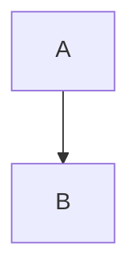

# Markdown Review Foundations Implementation Plan (plan 1 of 3)

> **For agentic workers:** REQUIRED SUB-SKILL: Use superpowers:subagent-driven-development (recommended) or superpowers:executing-plans to implement this plan task-by-task. Steps use checkbox (`- [ ]`) syntax for tracking.

**Goal:** Scaffold the repository with the StylesUI and pull-request-assistant toolchain, then build the shared core that plans 2 and 3 stand on: markdown blocks with canonical text, the render rules and their conformance test, the review-model schemas, the anchorer and the review store.

**Architecture:** `src/shared/` holds code the server and the browser both run: one markdown-it configuration, `parseBlocks` (leaf blocks with canonical text computed from tokens), document text and line mapping, and the zod schemas of the review model. `src/web/` holds the walk that reads the same canonical text back from rendered HTML, proven equal by a conformance test over a fixture corpus. `src/server/` holds the anchorer (exact, then approximate matching with approx-string-match) and the `ReviewStore`, which keeps `.markdown-review/` files valid, re-anchors a doc's threads whenever its source hash changes, and serializes every change.

**Tech Stack:** TypeScript 7 (`tsc -b`), pnpm 10.18.3, Vitest 5 (`node` and `web` projects, jsdom), oxlint, oxfmt, husky, lint-staged, fallow, markdown-it 15 with `@mdit/plugin-tasklist`, zod 4, approx-string-match 2, Shiki 4 and DOMPurify 3 (conformance test only).

**Spec:** `docs/superpowers/specs/2026-10-08-markdown-review-design.md`. This plan implements section 16 (project setup), the `markdown-config`, `blocks`, `anchorer` and `store` units of section 5, sections 6 and 7, and the unit and conformance tests of section 14. Plan 2 builds the server and CLI on the `ReviewStore` API produced here; plan 3 builds the web app on `createMarkdownIt`, `parseBlocks`, `createDocumentText` and `layOutBlockText`.

## Global Constraints

- Platform: macOS and Linux. Node.js `^22.22.2 || ^24.15.0 || >=26.0.0` (`engines`). pnpm `10.18.3` (`packageManager`).
- Install dependencies with `pnpm add` and no hand-written version, then run `pnpm format`, because oxfmt sorts `package.json` and `pnpm verify` fails until it has.
- Lint with oxlint and format with oxfmt (print width 120, 2-space indent, semicolons, double quotes, `es5` trailing commas). No ESLint.
- TypeScript: `strict`, `verbatimModuleSyntax`, `erasableSyntaxOnly`, `noUncheckedIndexedAccess`, `noUnusedLocals`, `noUnusedParameters`, `noFallthroughCasesInSwitch`, `moduleDetection: "force"`, target ES2023.
- The `coding-standards` plugin's TypeScript, comments and Vitest standards are authoritative over the code in this plan. Notably: full words in identifiers, `interface` for object shapes, one class per module, file names equal to their primary export, no comment unless a competent stranger would be blocked without it, multi-line JSDoc, tests named `must ... when ...` in one flat `describe` with Arrange-Act-Assert separated by blank lines.
- Code in `src/shared/` uses no Node or DOM APIs.
- Store layout (spec section 6): `<root>/.markdown-review/.gitignore` containing `*`, `review.json`, and `documents/<repo-relative doc path>.json`.
- Line numbers are 1-based and inclusive. Offsets are positions in a doc's canonical text (its blocks' texts joined with `\n`), end exclusive. `prefix` and `suffix` are at most 32 characters. Approximate matching allows `floor(0.2 * anchoredText.length)` errors.
- Every commit after the first passes the husky pre-commit hook: lint-staged, then `fallow audit`, which fails on findings the commit introduces. An export that nothing in the same commit uses (code or test) blocks the commit, so each task only adds exports its own code or tests use.

## Review Focus

The inputs below are implied by the spec but easy to miss. Each one has a test in the task that owns the code.

1. A code span, inline HTML tag or image that breaks across source lines hides that line break from markdown-it, so offsets after it map one line early. A reasonable person expects the reported line range to still contain the passage. Pinned by the "a code span hides the line break inside it" case of `parseBlocks.test.ts` (Task 2) and "must return a range containing the text when a code span hides a line break before it" in `linesForRange.test.ts` (Task 3).
2. The agent rewraps a paragraph while addressing a comment. The highlight should follow the passage onto both lines. Pinned by "must follow the text onto both lines when the agent rewraps the paragraph" (Task 6).
3. Only a doc's line endings change (git `autocrlf`, an editor setting). Anchors should not move. Pinned by "must leave the anchor unchanged when only the doc's line endings change" (Task 6).
4. A long whole-block comment, for example on a 40-line fence, whose block is replaced by unrelated code of the same length. The 20% error budget is large in absolute terms, but the thread must become outdated rather than land on unrelated text. Pinned by "must mark a whole-fence anchor outdated when the fence is replaced by unrelated code of the same length" (Task 6).
5. Docs whose names contain spaces or non-ASCII characters. Their threads must be stored and listed under the same repo-relative name. Pinned by "must store and list a doc's threads when its name has spaces and non-ASCII characters" (Task 8).

## Notes for the implementer

- Every file in this plan was written and run in a scratch copy of the repository on 2026-10-08, task by task, with each task committed through the real pre-commit hook. All 201 tests, lint, format check, typecheck and the fallow gate passed at every commit. Treat the code as correct but not as a reason to skip the failing-test step: run each test before its implementation exists and confirm it fails for the stated reason.
- The spec's interfaces in section 6 are implemented as zod schemas with types inferred from them (`z.infer`), the pattern pull-request-assistant uses for `settingsSchema`.
- `ReviewStore` itself re-anchors on read (spec section 7 says "the server"). Doing it in the store gives one choke point that no read path can skip.
- Spec items left to later plans: the `bin` entry, the `build` and `test:e2e` scripts, `.npmrc` for StylesUI, `.fallowrc.json` entry points (plan 2 adds `src/cli`), and the browser's use of `layOutBlockText` for selection and highlights (plan 3).
- Several helpers are taken from pull-request-assistant unchanged apart from paths: `OperationQueue`, `writeJsonAtomically`, `readTextFileOrNull`, `isFileNotFound`, `writeTextFileUnlessExists`, `setUpTemporaryDirectory`, `createGate`, `Logger` and `createMemoryLogger`. Their full contents are in the tasks below.

## File Structure

```
.claude/settings.json              enables the coding-standards plugin
.github/workflows/ci.yml           lint, format check, typecheck, tests on push and pull request
.husky/pre-commit                  lint-staged, then the fallow gate
AGENTS.md, CLAUDE.md               agent guidance (CLAUDE.md imports AGENTS.md)
src/shared/markdown/
  createMarkdownIt.ts              the shared markdown-it instance and its render rules
  findLeafBlocks.ts, LeafBlock.ts  which tokens are leaf blocks, and their trimmed line ranges
  inlineText.ts                    canonical text of an inline token's children
  parseBlocks.ts, MarkdownBlock.ts leaf blocks with canonical text and line offsets
  createDocumentText.ts, DocumentText.ts      the doc's canonical text
  blockAtOffset.ts, BlockPosition.ts          offset to block
  lineAtOffset.ts, linesForRange.ts, LineRange.ts   offset to source line
  tokenAt.ts, fenceLanguage.ts, withoutFinalNewline.ts   small token helpers
src/shared/review/
  isRepositoryRelativePath.ts      path check used by the schemas
  anchorSchema.ts, threadSchema.ts, newThreadSchema.ts   the review model
  documentThreadsFileSchema.ts, reviewFileSchema.ts, storeFileVersion.ts   store file formats
  ReviewState.ts                   approval state shared with the browser
  testing/reviewBuilders.ts        test data builders
src/web/rendering/
  layOutBlockText.ts, BlockTextLayout.ts   reads canonical text back from a rendered block
  sanitizeRenderedHtml.ts          DOMPurify wrapper used before insertion
  blockConformance.test.ts, testing/conformanceCorpus.md   the conformance test
src/server/anchoring/
  reanchorPassage.ts               exact, then approximate matching of one anchor
  reanchorDocumentThreads.ts       re-anchors or outdates a doc's passage threads
  anchorNewPassage.ts              anchors a fresh selection, re-anchoring when stale
src/server/store/
  ReviewStore.ts                   the store's public API, serialized by OperationQueue
  StoreFiles.ts, storePaths.ts, readStoreFile.ts, StoreFileResult.ts, emptyReviewFile.ts   store file I/O
  threadTransitions.ts, needsAgent.ts, toReviewState.ts, renumberDuplicateThreads.ts   pure rules
  StoreError.ts, StoredThreads.ts, hashSource.ts, OperationQueue.ts
src/server/files/                  generic file helpers from pull-request-assistant
src/server/logging/                Logger interface and an in-memory test logger
src/server/testing/                temporary directories and gates for tests
```

---

### Task 1: Scaffold the repository and prove the toolchain

This task creates the git repository, so it runs in the main checkout at `/Users/matt/Code/github.com/Krelborn/markdown-review`, which so far holds only `docs/`. It ends by creating the `foundations` branch that every later task commits to.

**Files:**
- Create: `.gitignore`, `LICENSE`, `package.json`, `tsconfig.json`, `tsconfig.server.json`, `tsconfig.web.json`, `tsconfig.node.json`, `vitest.config.mts`, `.oxlintrc.json`, `.oxfmtrc.json`, `.lintstagedrc.json`, `.fallowrc.json`, `.husky/pre-commit`, `.claude/settings.json`, `.github/workflows/ci.yml`, `AGENTS.md`, `CLAUDE.md`, `src/shared/review/isRepositoryRelativePath.ts`
- Generated: `pnpm-lock.yaml`; by `fallow agent install`: `.mcp.json`, `.codex/config.toml`, `.claude/skills/fallow/`, `.claude/skills/fallow-setup/`, `.agents/skills/fallow/`, `.agents/skills/fallow-setup/`
- Test: `src/shared/review/isRepositoryRelativePath.test.ts`

**Interfaces:**
- Consumes: nothing.
- Produces: `isRepositoryRelativePath(value: string): boolean`, used by `documentPathSchema` in Task 5.

- [ ] **Step 1: Create the repository**

```bash
cd /Users/matt/Code/github.com/Krelborn/markdown-review
git init -b main
git remote add origin https://github.com/Krelborn/markdown-review.git
```

The GitHub repository exists, is private and is empty. Do not push in this plan; pushing is decided after the last task.

- [ ] **Step 2: Write `.gitignore`, `LICENSE` and `package.json`**

`.gitignore`:

````text
node_modules/
dist/
coverage/
*.log
*.tsbuildinfo
.DS_Store
.superpowers/
````

`LICENSE`:

````text
MIT License

Copyright (c) 2026 Matt Styles

Permission is hereby granted, free of charge, to any person obtaining a copy
of this software and associated documentation files (the "Software"), to deal
in the Software without restriction, including without limitation the rights
to use, copy, modify, merge, publish, distribute, sublicense, and/or sell
copies of the Software, and to permit persons to whom the Software is
furnished to do so, subject to the following conditions:

The above copyright notice and this permission notice shall be included in all
copies or substantial portions of the Software.

THE SOFTWARE IS PROVIDED "AS IS", WITHOUT WARRANTY OF ANY KIND, EXPRESS OR
IMPLIED, INCLUDING BUT NOT LIMITED TO THE WARRANTIES OF MERCHANTABILITY,
FITNESS FOR A PARTICULAR PURPOSE AND NONINFRINGEMENT. IN NO EVENT SHALL THE
AUTHORS OR COPYRIGHT HOLDERS BE LIABLE FOR ANY CLAIM, DAMAGES OR OTHER
LIABILITY, WHETHER IN AN ACTION OF CONTRACT, TORT OR OTHERWISE, ARISING FROM,
OUT OF OR IN CONNECTION WITH THE SOFTWARE OR THE USE OR OTHER DEALINGS IN THE
SOFTWARE.
````

`package.json` (dependencies are added by `pnpm add` in Step 5):

````json
{
  "name": "@krelborn/markdown-review",
  "version": "0.1.0",
  "description": "Review agent-written markdown in the browser and hand the comments back to the agent",
  "license": "MIT",
  "repository": {
    "type": "git",
    "url": "git+https://github.com/Krelborn/markdown-review.git"
  },
  "type": "module",
  "publishConfig": {
    "access": "public",
    "registry": "https://registry.npmjs.org/"
  },
  "scripts": {
    "typecheck": "tsc -b",
    "lint": "oxlint",
    "format": "oxfmt",
    "format:check": "oxfmt --check",
    "test": "vitest run",
    "test:coverage": "pnpm test --coverage",
    "test:watch": "vitest",
    "verify": "pnpm lint && pnpm format:check && pnpm typecheck && pnpm test",
    "prepare": "husky"
  },
  "engines": {
    "node": "^22.22.2 || ^24.15.0 || >=26.0.0"
  },
  "packageManager": "pnpm@10.18.3"
}
````

- [ ] **Step 3: Write the TypeScript and Vitest configuration**

`tsconfig.json`:

````json
{
  "files": [],
  "references": [
    { "path": "./tsconfig.server.json" },
    { "path": "./tsconfig.web.json" },
    { "path": "./tsconfig.node.json" }
  ]
}
````

`tsconfig.server.json` (Node code: the CLI, the server and shared code):

````json
{
  "compilerOptions": {
    "tsBuildInfoFile": "./node_modules/.tmp/tsconfig.server.tsbuildinfo",
    "target": "es2023",
    "lib": ["ES2023"],
    "module": "esnext",
    "moduleResolution": "bundler",
    "types": ["node"],
    "strict": true,
    "skipLibCheck": true,
    "verbatimModuleSyntax": true,
    "moduleDetection": "force",
    "noEmit": true,
    "noUnusedLocals": true,
    "noUnusedParameters": true,
    "noUncheckedIndexedAccess": true,
    "erasableSyntaxOnly": true,
    "noFallthroughCasesInSwitch": true
  },
  "include": ["src/cli", "src/server", "src/shared"]
}
````

`tsconfig.web.json` (browser code and shared code):

````json
{
  "compilerOptions": {
    "tsBuildInfoFile": "./node_modules/.tmp/tsconfig.web.tsbuildinfo",
    "target": "es2023",
    "lib": ["ES2023", "DOM", "DOM.Iterable"],
    "module": "esnext",
    "moduleResolution": "bundler",
    "types": ["vite/client"],
    "jsx": "react-jsx",
    "strict": true,
    "skipLibCheck": true,
    "verbatimModuleSyntax": true,
    "moduleDetection": "force",
    "noEmit": true,
    "noUnusedLocals": true,
    "noUnusedParameters": true,
    "noUncheckedIndexedAccess": true,
    "erasableSyntaxOnly": true,
    "noFallthroughCasesInSwitch": true
  },
  "include": ["src/web", "src/shared"]
}
````

`tsconfig.node.json` (tool configuration files):

````json
{
  "compilerOptions": {
    "tsBuildInfoFile": "./node_modules/.tmp/tsconfig.node.tsbuildinfo",
    "target": "es2023",
    "lib": ["ES2023"],
    "module": "nodenext",
    "types": ["node"],
    "strict": true,
    "skipLibCheck": true,
    "verbatimModuleSyntax": true,
    "moduleDetection": "force",
    "noEmit": true,
    "noUnusedLocals": true,
    "noUnusedParameters": true,
    "erasableSyntaxOnly": true
  },
  "include": ["vitest.config.mts"]
}
````

`vitest.config.mts`:

````ts
import { defineConfig } from "vitest/config";

export default defineConfig({
  test: {
    coverage: {
      exclude: ["src/**/*.d.ts"],
      include: ["src/**/*.{ts,tsx}"],
      // fallow reads coverage/coverage-final.json without being asked, which would make commit checks depend on a stale
      // local report, so the json report goes under another name and `fallow health --coverage` is pointed at it
      reporter: ["text-summary", ["json", { file: "istanbul.json" }]],
    },
    passWithNoTests: true,
    projects: [
      {
        extends: true,
        test: {
          env: { TZ: "UTC" },
          environment: "node",
          include: ["src/cli/**/*.test.ts", "src/server/**/*.test.ts", "src/shared/**/*.test.ts"],
          name: "node",
        },
      },
      {
        extends: true,
        test: {
          env: { TZ: "UTC" },
          environment: "jsdom",
          include: ["src/web/**/*.test.{ts,tsx}"],
          name: "web",
        },
      },
    ],
  },
});
````

- [ ] **Step 4: Write the lint, format and hook configuration**

`.oxlintrc.json` (pull-request-assistant's rules, with this repo's ignore patterns):

````json
{
  "$schema": "./node_modules/oxlint/configuration_schema.json",
  "plugins": ["react", "typescript", "oxc", "jsx-a11y"],
  "ignorePatterns": ["dist", "coverage", "node_modules"],
  "settings": {
    "jsx-a11y": {
      "polymorphicPropName": "as",
      "components": {
        "Alert": "div",
        "Button": "button",
        "Checkbox": "input",
        "Divider": "hr",
        "Link": "a",
        "Select": "select",
        "Switch": "input",
        "TextInput": "input"
      }
    }
  },
  "rules": {
    "react/rules-of-hooks": "error",
    "react/only-export-components": [
      "warn",
      {
        "allowConstantExport": true
      }
    ],
    "jsx-a11y/alt-text": "error",
    "jsx-a11y/anchor-has-content": "error",
    "jsx-a11y/anchor-is-valid": "error",
    "jsx-a11y/aria-activedescendant-has-tabindex": "error",
    "jsx-a11y/aria-props": "error",
    "jsx-a11y/aria-proptypes": "error",
    "jsx-a11y/aria-role": "error",
    "jsx-a11y/aria-unsupported-elements": "error",
    "jsx-a11y/click-events-have-key-events": "error",
    "jsx-a11y/control-has-associated-label": "error",
    "jsx-a11y/heading-has-content": [
      "error",
      {
        "components": ["Heading"]
      }
    ],
    "jsx-a11y/html-has-lang": "error",
    "jsx-a11y/img-redundant-alt": "error",
    "jsx-a11y/interactive-supports-focus": "error",
    "jsx-a11y/label-has-associated-control": "error",
    "jsx-a11y/no-access-key": "error",
    "jsx-a11y/no-aria-hidden-on-focusable": "error",
    "jsx-a11y/no-autofocus": "error",
    "jsx-a11y/no-interactive-element-to-noninteractive-role": "error",
    "jsx-a11y/no-noninteractive-element-interactions": "error",
    "jsx-a11y/no-noninteractive-element-to-interactive-role": "error",
    "jsx-a11y/no-noninteractive-tabindex": "error",
    "jsx-a11y/no-redundant-roles": "error",
    "jsx-a11y/no-static-element-interactions": "error",
    "jsx-a11y/prefer-tag-over-role": "off",
    "jsx-a11y/role-has-required-aria-props": "error",
    "jsx-a11y/role-supports-aria-props": "error",
    "jsx-a11y/tabindex-no-positive": "error"
  }
}
````

`.oxfmtrc.json`:

````json
{
  "$schema": "./node_modules/oxfmt/configuration_schema.json",
  "printWidth": 120,
  "tabWidth": 2,
  "useTabs": false,
  "semi": true,
  "singleQuote": false,
  "trailingComma": "es5",
  "ignorePatterns": [
    "pnpm-lock.yaml",
    "dist/**",
    "docs/**",
    ".superpowers/**",
    // The conformance corpus keeps the exact markdown it was written with
    "src/**/testing/*.md",
    // Skill pointers written by `fallow agent install`, which rewrites them when they are reformatted
    ".agents/skills/fallow/**",
    ".agents/skills/fallow-setup/**",
    ".claude/skills/fallow/**",
    ".claude/skills/fallow-setup/**"
  ]
}
````

`.lintstagedrc.json`:

````json
{
  "*.{js,jsx,ts,tsx,mjs,cjs,mts,cts}": ["oxlint --fix", "oxfmt --no-error-on-unmatched-pattern"],
  "!(*.{js,jsx,ts,tsx,mjs,cjs,mts,cts})": "oxfmt --no-error-on-unmatched-pattern"
}
````

`.fallowrc.json` (plan 2 adds the CLI entry point):

````json
{
  "$schema": "https://raw.githubusercontent.com/fallow-rs/fallow/main/schema.json"
}
````

`.husky/pre-commit` (pull-request-assistant's hook, plus a guard: `fallow audit` exits with "could not detect base branch" on a repository's first commit):

````sh
pnpm exec lint-staged
# The repository's first commit has no base branch for fallow to compare against
git rev-parse --verify --quiet HEAD >/dev/null || exit 0
pnpm exec fallow audit --quiet --gate-marker pre-commit
````

- [ ] **Step 5: Install the toolchain and fallow's agent files**

```bash
pnpm add -D typescript @types/node vitest @vitest/coverage-v8 vite oxlint oxfmt husky lint-staged fallow
pnpm exec fallow agent install --harness claude --harness codex --without guide --without hooks
pnpm format
```

Expected: `fallow agent install` reports `.claude/skills/fallow`, `.claude/skills/fallow-setup`, `.mcp.json` and `.codex/config.toml` as written, and also writes `.agents/skills/fallow` and `.agents/skills/fallow-setup`. `pnpm format` reformats the `.mcp.json` it wrote and sorts `package.json`.

- [ ] **Step 6: Write the agent guidance, Claude Code settings and CI workflow**

`.claude/settings.json`:

````json
{
  "$schema": "https://json.schemastore.org/claude-code-settings.json",
  "extraKnownMarketplaces": {
    "krelborn-standards": {
      "source": {
        "source": "github",
        "repo": "Krelborn/agent-coding-standards"
      }
    }
  },
  "enabledPlugins": {
    "coding-standards@krelborn-standards": true
  }
}
````

`.github/workflows/ci.yml` (StylesUI's workflow without the Playwright and build steps, which plans 2 and 3 add):

````yaml
name: CI

on:
  push:
    branches: [main]
  pull_request:

permissions:
  contents: read

jobs:
  verify:
    runs-on: ubuntu-latest
    steps:
      - uses: actions/checkout@v7

      - uses: pnpm/action-setup@v6

      - uses: actions/setup-node@v7
        with:
          node-version: 22
          cache: pnpm

      - run: pnpm install --frozen-lockfile

      - run: pnpm lint
      - run: pnpm format:check
      - run: pnpm typecheck
      - run: pnpm test
````

`AGENTS.md`:

````markdown
# AGENTS.md

Markdown Review: a local tool for reviewing agent-written markdown in a browser and handing the comments back to the coding agent through a CLI. The design is `docs/superpowers/specs/2026-10-08-markdown-review-design.md`; the build plans are in `docs/superpowers/plans/`.

## Commands

- `pnpm test`: unit tests (`node` project for `src/cli`, `src/server` and `src/shared`; `web` project in jsdom for `src/web`)
- `pnpm test:coverage`: unit tests with v8 coverage, written to `coverage/istanbul.json`
- `pnpm verify`: lint, format check, typecheck and tests

## Layout

- `src/shared/`: code the server and the browser both run: the markdown-it configuration, blocks and canonical text, and the zod schemas of the review model. No Node or DOM APIs.
- `src/server/`: the anchorer and the review store.
- `src/web/`: browser code: the walk that reads canonical text from rendered blocks, and the conformance test that checks it against `src/shared`.

## Anchoring

Comments anchor to offsets in a doc's canonical text, which `parseBlocks` computes from markdown-it tokens and the browser reads back from the rendered page with `layOutBlockText`. The two must agree exactly: run the `web` project's conformance test after any change to `createMarkdownIt`, the markdown plugins, Shiki or DOMPurify, and add a case to `src/web/rendering/testing/conformanceCorpus.md` for any new kind of content.

Install dependencies with `pnpm add` and no hand-written version, then run `pnpm format`, which sorts `package.json`.

## Fallow

fallow is a devDependency; run it as `pnpm exec fallow`. Its skill is `node_modules/fallow/skills/fallow/SKILL.md`.

- The husky pre-commit hook runs `fallow audit` on every commit after the first. A `fail` verdict blocks the commit: fix the findings it reports. Only findings the commit introduces count, so every new export must be used by code or tests in the same commit.
- The commit check estimates test coverage from which tests import a function. For exact CRAP scores run `pnpm test:coverage`, then `pnpm exec fallow health --coverage coverage/istanbul.json`.
- To refresh the skill pointers and MCP config after upgrading fallow, run `pnpm exec fallow agent install --harness claude --harness codex --without guide --without hooks`.
````

`CLAUDE.md` (the shape pull-request-assistant uses; the markers are fallow's):

````markdown
# CLAUDE.md

The project guidance shared with other agents is in `AGENTS.md`, imported at the end of this file.

## Coding standards

The `coding-standards` plugin (enabled in `.claude/settings.json`) loads the TypeScript, React, comments and Vitest standards whenever a matching file is read or edited. They are authoritative over any code in the spec or plan.

<!-- fallow:agent-install v1 claude-import:start -->

@AGENTS.md
<!-- fallow:agent-install v1 claude-import:end -->
````

- [ ] **Step 7: Write the failing test**

`src/shared/review/isRepositoryRelativePath.test.ts`:

````ts
import { describe, expect, test } from "vitest";

import { isRepositoryRelativePath } from "./isRepositoryRelativePath";

describe("isRepositoryRelativePath", () => {
  test.each([
    { value: "README.md", expected: true },
    { value: "docs/plans/plan.md", expected: true },
    { value: "", expected: false },
    { value: "/etc/passwd", expected: false },
    { value: "../outside.md", expected: false },
    { value: "docs/../../outside.md", expected: false },
    { value: "docs//plan.md", expected: false },
    { value: "./plan.md", expected: false },
    { value: "docs\\plan.md", expected: false },
  ])("must return $expected when the path is '$value'", ({ value, expected }) => {
    expect(isRepositoryRelativePath(value)).toBe(expected);
  });
});
````

- [ ] **Step 8: Run the test to verify it fails**

Run: `pnpm test`
Expected: FAIL with `Failed to resolve import "./isRepositoryRelativePath"`.

- [ ] **Step 9: Write the implementation**

`src/shared/review/isRepositoryRelativePath.ts`:

````ts
/**
 * Tells whether a path names a file inside the repo without leaving it
 *
 * @param value the path to check
 * @returns true for a relative POSIX path with no empty, "." or ".." segments
 */
export function isRepositoryRelativePath(value: string): boolean {
  if (value === "" || value.startsWith("/") || value.includes("\\")) {
    return false;
  }
  return value.split("/").every((segment) => segment !== "" && segment !== "." && segment !== "..");
}
````

- [ ] **Step 10: Run the whole check**

Run: `pnpm verify`
Expected: lint and format check clean, `tsc -b` reports no errors, 9 tests pass.

- [ ] **Step 11: Activate the git hooks**

Run: `pnpm install`, then `git config core.hooksPath`
Expected: `.husky/_`

- [ ] **Step 12: Make the first commit and create the branch**

```bash
git add -A
git commit -m "Scaffold the repository with the shared toolchain"
git switch -c foundations
```

Expected: the hook runs lint-staged, then skips fallow because the repository has no commits yet. The commit includes `docs/`, so the spec and this plan are tracked from the start.

---

### Task 2: Parse markdown into blocks with canonical text

**Files:**
- Create: `src/shared/markdown/tokenAt.ts`, `LeafBlock.ts`, `findLeafBlocks.ts`, `fenceLanguage.ts`, `withoutFinalNewline.ts`, `createMarkdownIt.ts`, `inlineText.ts`, `MarkdownBlock.ts`, `parseBlocks.ts` (all in `src/shared/markdown/`)
- Test: `src/shared/markdown/parseBlocks.test.ts`

**Interfaces:**
- Consumes: nothing from earlier tasks.
- Produces:
  - `parseBlocks(source: string): MarkdownBlock[]`
  - `interface MarkdownBlock { startLine: number; endLine: number; text: string; lineOffsets: LineOffset[]; exactLines: boolean; wholeBlockOnly: boolean }` and `interface LineOffset { line: number; offset: number }`
  - `createMarkdownIt(): MarkdownIt` (Task 4 gives it an optional `MarkdownRenderingOptions` parameter)
  - `findLeafBlocks(tokens: readonly Token[], source: string): LeafBlock[]`, `interface LeafBlock { kind: LeafBlockKind; token: Token; tokenIndex: number; startLine: number; endLine: number }`
  - `tokenAt(tokens: readonly Token[], index: number): Token`, `fenceLanguage(info: string): string`, `withoutFinalNewline(content: string): string` (Task 4 reuses all three)

- [ ] **Step 1: Add the markdown dependencies**

```bash
pnpm add markdown-it @mdit/plugin-tasklist
pnpm format
```

- [ ] **Step 2: Write the failing test**

`src/shared/markdown/parseBlocks.test.ts`:

````ts
import { describe, expect, test } from "vitest";

import type { MarkdownBlock } from "./MarkdownBlock";
import { parseBlocks } from "./parseBlocks";

describe("parseBlocks", () => {
  test.each<{ condition: string; source: string; expected: MarkdownBlock[] }>([
    {
      condition: "the doc has a heading and a two-line paragraph",
      source: "# Title\n\nPara one\nline two\n",
      expected: [
        oneLineBlock(1, "Title"),
        {
          endLine: 4,
          lineOffsets: [
            { line: 3, offset: 0 },
            { line: 4, offset: 9 },
          ],
          startLine: 3,
          text: "Para one\nline two",
          exactLines: true,
          wholeBlockOnly: false,
        },
      ],
    },
    {
      condition: "a setext heading's underline is on the next line",
      source: "Title\n=====\n",
      expected: [{ ...oneLineBlock(1, "Title"), endLine: 2 }],
    },
    {
      condition: "the list is loose, so each item is followed by a blank line",
      source: "- one\n\n- two\n\n  more\n",
      expected: [oneLineBlock(1, "one"), oneLineBlock(3, "two"), oneLineBlock(5, "more")],
    },
    {
      condition: "a tight list has a nested list",
      source: "- a\n  - b\n\n- c\n",
      expected: [oneLineBlock(1, "a"), oneLineBlock(2, "b"), oneLineBlock(4, "c")],
    },
    {
      condition: "the list items are tasks",
      source: "- [ ] todo *one*\n- [x] done\n",
      expected: [oneLineBlock(1, " todo one"), oneLineBlock(2, " done")],
    },
    {
      condition: "a blockquote holds two paragraphs",
      source: "> a\n>\n> b\n",
      expected: [oneLineBlock(1, "a"), oneLineBlock(3, "b")],
    },
    {
      condition: "a table has a header row and a body row",
      source: "| a | b |\n|---|---|\n| 1 | `2` |\n",
      expected: [oneLineBlock(1, "a\tb"), oneLineBlock(3, "1\t2")],
    },
    {
      condition: "a code span hides the line break inside it",
      source: "Use `a\nb` here\nand more\n",
      expected: [
        {
          endLine: 3,
          exactLines: false,
          lineOffsets: [
            { line: 1, offset: 0 },
            { line: 2, offset: 13 },
          ],
          startLine: 1,
          text: "Use a b here\nand more",
          wholeBlockOnly: false,
        },
      ],
    },
    {
      condition: "a paragraph holds entities, inline HTML, an image and a code span",
      source: "A &copy; <b>B</b>  `c`\n",
      expected: [oneLineBlock(1, "A © B  c")],
    },
    {
      condition: "a fence holds two lines of code",
      source: "```ts\nconst a = 1;\nconst b = 2;\n```\n",
      expected: [
        {
          endLine: 4,
          lineOffsets: [
            { line: 2, offset: 0 },
            { line: 3, offset: 13 },
          ],
          startLine: 1,
          text: "const a = 1;\nconst b = 2;",
          exactLines: true,
          wholeBlockOnly: false,
        },
      ],
    },
    {
      condition: "a fence is never closed and ends in a blank line",
      source: "```\ncode\n\n",
      expected: [
        {
          endLine: 2,
          lineOffsets: [{ line: 2, offset: 0 }],
          startLine: 1,
          text: "code\n",
          exactLines: true,
          wholeBlockOnly: false,
        },
      ],
    },
    {
      condition: "a fence is empty",
      source: "```\n```\n",
      expected: [{ endLine: 2, lineOffsets: [], startLine: 1, text: "", exactLines: true, wholeBlockOnly: false }],
    },
    {
      condition: "a fence holds a Mermaid diagram",
      source: "```mermaid\ngraph TD\n```\n",
      expected: [
        {
          endLine: 3,
          lineOffsets: [{ line: 2, offset: 0 }],
          startLine: 1,
          text: "graph TD",
          exactLines: true,
          wholeBlockOnly: true,
        },
      ],
    },
    {
      condition: "an indented code block holds a blank line",
      source: "    one\n\n    two\n",
      expected: [
        {
          endLine: 3,
          lineOffsets: [
            { line: 1, offset: 0 },
            { line: 2, offset: 4 },
            { line: 3, offset: 5 },
          ],
          startLine: 1,
          text: "one\n\ntwo",
          exactLines: true,
          wholeBlockOnly: false,
        },
      ],
    },
    {
      condition: "an HTML block spans three lines",
      source: "<div>\n<b>x</b>\n</div>\n",
      expected: [
        {
          endLine: 3,
          lineOffsets: [
            { line: 1, offset: 0 },
            { line: 2, offset: 6 },
            { line: 3, offset: 15 },
          ],
          startLine: 1,
          text: "<div>\n<b>x</b>\n</div>",
          exactLines: true,
          wholeBlockOnly: true,
        },
      ],
    },
    {
      condition: "the source has Windows line endings",
      source: "a\r\nb\r\n\r\nc\r\n",
      expected: [
        {
          endLine: 2,
          lineOffsets: [
            { line: 1, offset: 0 },
            { line: 2, offset: 2 },
          ],
          startLine: 1,
          text: "a\nb",
          exactLines: true,
          wholeBlockOnly: false,
        },
        oneLineBlock(4, "c"),
      ],
    },
  ])("must find the blocks, their lines and their text when $condition", ({ source, expected }) => {
    expect(parseBlocks(source)).toEqual(expected);
  });
});

function oneLineBlock(line: number, text: string): MarkdownBlock {
  return {
    endLine: line,
    lineOffsets: [{ line, offset: 0 }],
    startLine: line,
    text,
    exactLines: true,
    wholeBlockOnly: false,
  };
}
````

- [ ] **Step 3: Run the test to verify it fails**

Run: `pnpm test src/shared/markdown`
Expected: FAIL with `Failed to resolve import "./parseBlocks"`.

- [ ] **Step 4: Write the token helpers**

`src/shared/markdown/tokenAt.ts`:

````ts
import type { Token } from "markdown-it";

/**
 * Reads a token that markdown-it guarantees is present, such as the token a render rule was called for
 *
 * @param tokens the token stream
 * @param index the token's position in the stream
 * @returns the token
 * @throws RangeError when no token is at that position
 */
export function tokenAt(tokens: readonly Token[], index: number): Token {
  const token = tokens[index];
  if (token === undefined) {
    throw new RangeError(`No markdown token at index ${index} of ${tokens.length}`);
  }
  return token;
}
````

`src/shared/markdown/fenceLanguage.ts`:

````ts
/**
 * Reads the language of a fenced code block from its info string
 *
 * @param info the text after the opening fence, e.g. "ts title=example"
 * @returns the first word of the info string, or an empty string when there is none
 */
export function fenceLanguage(info: string): string {
  return info.trim().split(/\s+/)[0] ?? "";
}
````

`src/shared/markdown/withoutFinalNewline.ts`:

````ts
/**
 * Removes one trailing newline, as markdown-it leaves on the content of code and HTML blocks
 *
 * @param content the block content
 * @returns the content without its final newline
 */
export function withoutFinalNewline(content: string): string {
  return content.endsWith("\n") ? content.slice(0, -1) : content;
}
````

- [ ] **Step 5: Write leaf block discovery**

`src/shared/markdown/LeafBlock.ts`:

````ts
import type { Token } from "markdown-it";

export type LeafBlockKind = "inline" | "tableRow" | "fence" | "codeBlock" | "htmlBlock";

/**
 * A token that opens a leaf block, the unit comments anchor to
 */
export interface LeafBlock {
  kind: LeafBlockKind;
  token: Token;
  tokenIndex: number;

  /**
   * 1-based and inclusive, like `endLine`
   */
  startLine: number;

  /**
   * Excludes trailing blank lines, which markdown-it includes in some list items
   */
  endLine: number;
}
````

`src/shared/markdown/findLeafBlocks.ts`:

````ts
import type { Token } from "markdown-it";

import type { LeafBlock, LeafBlockKind } from "./LeafBlock";

const leafBlockKinds: Partial<Record<string, LeafBlockKind>> = {
  code_block: "codeBlock",
  fence: "fence",
  heading_open: "inline",
  html_block: "htmlBlock",
  paragraph_open: "inline",
  tr_open: "tableRow",
};

/**
 * Finds the leaf blocks of a parsed doc
 *
 * @param tokens the token stream markdown-it parsed from `source`
 * @param source the markdown source
 * @returns the leaf blocks in document order
 */
export function findLeafBlocks(tokens: readonly Token[], source: string): LeafBlock[] {
  const sourceLines = source.split(/\r\n?|\n/);
  const leafBlocks: LeafBlock[] = [];
  tokens.forEach((token, tokenIndex) => {
    const kind = leafBlockKinds[token.type];
    if (kind === undefined || token.map === null) {
      return;
    }
    const [lineBegin, lineEnd] = token.map;
    leafBlocks.push({
      endLine: lastLineWithText(sourceLines, lineBegin, lineEnd),
      kind,
      startLine: lineBegin + 1,
      token,
      tokenIndex,
    });
  });
  return leafBlocks;
}

function lastLineWithText(sourceLines: readonly string[], lineBegin: number, lineEnd: number): number {
  let endLine = lineEnd;
  while (endLine > lineBegin + 1 && (sourceLines[endLine - 1] ?? "").trim() === "") {
    endLine -= 1;
  }
  return endLine;
}
````

- [ ] **Step 6: Write the shared markdown-it instance**

`src/shared/markdown/createMarkdownIt.ts` (Task 4 replaces this with the version that carries the render rules):

````ts
import { tasklist } from "@mdit/plugin-tasklist";
import markdownIt from "markdown-it";
import type { MarkdownIt } from "markdown-it";

/**
 * Creates the markdown-it instance the server and the browser share, so both find the same blocks
 *
 * @returns an instance that allows raw HTML and renders task lists
 */
export function createMarkdownIt(): MarkdownIt {
  return new markdownIt({ html: true }).use(tasklist);
}
````

- [ ] **Step 7: Write canonical text and `parseBlocks`**

`src/shared/markdown/inlineText.ts`:

````ts
import type { Token } from "markdown-it";

export interface InlineText {
  text: string;

  /**
   * The offset in `text` where each source line after the first starts
   */
  lineStartOffsets: number[];
}

const textTokenTypes = new Set(["text", "text_special", "code_inline"]);

const lineBreakTokenTypes = new Set(["softbreak", "hardbreak"]);

/**
 * Reads the canonical text of a paragraph, heading or table cell
 *
 * @param children the children of the block's inline token
 * @returns the text as the browser shows it, with each line break as "\n"; images and HTML tags contribute nothing
 */
export function inlineText(children: readonly Token[]): InlineText {
  let text = "";
  const lineStartOffsets: number[] = [];
  for (const child of children) {
    if (textTokenTypes.has(child.type)) {
      text += child.content;
    } else if (lineBreakTokenTypes.has(child.type)) {
      text += "\n";
      lineStartOffsets.push(text.length);
    }
  }
  return { lineStartOffsets, text };
}
````

`src/shared/markdown/MarkdownBlock.ts`:

````ts
export interface LineOffset {
  line: number;
  offset: number;
}

/**
 * A leaf block of a doc as both the server and the browser see it
 */
export interface MarkdownBlock {
  /**
   * 1-based and inclusive, like `endLine`
   */
  startLine: number;

  endLine: number;

  /**
   * The block's canonical text: what the browser shows, read from the tokens rather than the DOM
   */
  text: string;

  /**
   * For each source line that contributes text, its 1-based number and the offset in `text` where that line starts
   */
  lineOffsets: LineOffset[];

  /**
   * False when a line break inside a code span, an HTML tag or an image left no trace in `text`, so offsets after it
   * map to an earlier line than the true one
   */
  exactLines: boolean;

  /**
   * True for HTML blocks and Mermaid fences, which take whole-block comments only and whose text is their source
   */
  wholeBlockOnly: boolean;
}
````

`src/shared/markdown/parseBlocks.ts`:

````ts
import type { Token } from "markdown-it";

import { createMarkdownIt } from "./createMarkdownIt";
import { fenceLanguage } from "./fenceLanguage";
import { findLeafBlocks } from "./findLeafBlocks";
import { inlineText } from "./inlineText";
import type { LeafBlock } from "./LeafBlock";
import type { LineOffset, MarkdownBlock } from "./MarkdownBlock";
import { tokenAt } from "./tokenAt";
import { withoutFinalNewline } from "./withoutFinalNewline";

const markdown = createMarkdownIt();

/**
 * Splits a doc into the leaf blocks comments anchor to
 *
 * @param source the markdown source
 * @returns the leaf blocks in document order, each with its canonical text
 */
export function parseBlocks(source: string): MarkdownBlock[] {
  const tokens = markdown.parse(source, {});
  return findLeafBlocks(tokens, source).map((leafBlock) => toMarkdownBlock(tokens, leafBlock));
}

function toMarkdownBlock(tokens: readonly Token[], leafBlock: LeafBlock): MarkdownBlock {
  const { endLine, kind, startLine, token, tokenIndex } = leafBlock;
  switch (kind) {
    case "inline": {
      const { lineStartOffsets, text } = inlineText(tokenAt(tokens, tokenIndex + 1).children ?? []);
      const lineOffsets = [0, ...lineStartOffsets].map((offset, index) => ({ line: startLine + index, offset }));
      const isSetextHeading = token.markup === "=" || token.markup === "-";
      const textLineCount = endLine - startLine + (isSetextHeading ? 0 : 1);
      const exactLines = lineOffsets.length === textLineCount;
      return { endLine, exactLines, lineOffsets, startLine, text, wholeBlockOnly: false };
    }
    case "tableRow": {
      const text = tableRowCells(tokens, tokenIndex).join("\t");
      const lineOffsets = [{ line: startLine, offset: 0 }];
      return { endLine, exactLines: true, lineOffsets, startLine, text, wholeBlockOnly: false };
    }
    case "fence": {
      const text = withoutFinalNewline(token.content);
      const wholeBlockOnly = fenceLanguage(token.info) === "mermaid";
      const lineOffsets = codeLineOffsets(text, startLine + 1, endLine);
      return { endLine, exactLines: true, lineOffsets, startLine, text, wholeBlockOnly };
    }
    case "codeBlock":
    case "htmlBlock": {
      const text = withoutFinalNewline(token.content);
      const wholeBlockOnly = kind === "htmlBlock";
      const lineOffsets = codeLineOffsets(text, startLine, endLine);
      return { endLine, exactLines: true, lineOffsets, startLine, text, wholeBlockOnly };
    }
  }
}

function tableRowCells(tokens: readonly Token[], rowTokenIndex: number): string[] {
  const cells: string[] = [];
  for (let index = rowTokenIndex + 1; index < tokens.length; index++) {
    const token = tokenAt(tokens, index);
    if (token.type === "tr_close") {
      break;
    }
    if (token.type === "inline") {
      cells.push(inlineText(token.children ?? []).text);
    }
  }
  return cells;
}

function codeLineOffsets(text: string, firstLine: number, lastLine: number): LineOffset[] {
  if (text === "") {
    return [];
  }
  const lineOffsets: LineOffset[] = [{ line: firstLine, offset: 0 }];
  for (let offset = text.indexOf("\n"); offset !== -1; offset = text.indexOf("\n", offset + 1)) {
    lineOffsets.push({ line: firstLine + lineOffsets.length, offset: offset + 1 });
  }
  return lineOffsets.filter(({ line }) => line <= lastLine);
}
````

- [ ] **Step 8: Run the tests to verify they pass**

Run: `pnpm test src/shared/markdown`, then `pnpm verify`
Expected: 16 `parseBlocks` cases pass; `pnpm verify` is clean.

- [ ] **Step 9: Commit**

```bash
git add -A
git commit -m "Parse markdown into leaf blocks with canonical text"
```

---

### Task 3: Map offsets in a doc's canonical text to source lines

**Files:**
- Create: `src/shared/markdown/LineRange.ts`, `DocumentText.ts`, `BlockPosition.ts`, `blockAtOffset.ts`, `createDocumentText.ts`, `lineAtOffset.ts`, `linesForRange.ts`
- Test: `src/shared/markdown/createDocumentText.test.ts`, `lineAtOffset.test.ts`, `linesForRange.test.ts`

**Interfaces:**
- Consumes: `parseBlocks(source: string): MarkdownBlock[]` and `MarkdownBlock` from Task 2.
- Produces:
  - `createDocumentText(source: string): DocumentText`, `interface DocumentText { text: string; blocks: MarkdownBlock[]; blockStartOffsets: number[] }`
  - `blockAtOffset(documentText: DocumentText, offset: number): BlockPosition | null`, `interface BlockPosition { block: MarkdownBlock; offsetInBlock: number }`
  - `lineAtOffset(documentText: DocumentText, offset: number): number`
  - `linesForRange(documentText: DocumentText, startOffset: number, endOffset: number): LineRange`, `interface LineRange { startLine: number; endLine: number }`

- [ ] **Step 1: Write the failing tests**

`src/shared/markdown/createDocumentText.test.ts`:

````ts
import { describe, expect, test } from "vitest";

import { createDocumentText } from "./createDocumentText";

describe("createDocumentText", () => {
  test("must join the blocks' text with newlines and record where each block starts when the doc has several blocks", () => {
    const documentText = createDocumentText("# Title\n\nPara one\nline two\n\n```\nx\n```\n");

    expect(documentText.text).toBe("Title\nPara one\nline two\nx");
    expect(documentText.blockStartOffsets).toEqual([0, 6, 24]);
  });

  test("must give empty text when the doc has no blocks", () => {
    const documentText = createDocumentText("");

    expect(documentText).toEqual({ blockStartOffsets: [], blocks: [], text: "" });
  });
});
````

`src/shared/markdown/lineAtOffset.test.ts`:

````ts
import { describe, expect, test } from "vitest";

import { createDocumentText } from "./createDocumentText";
import { lineAtOffset } from "./lineAtOffset";

const documentText = createDocumentText("# Title\n\nPara one\nline two\n\n```\nx\ny\n```\n");

describe("lineAtOffset", () => {
  test.each([
    { condition: "it is the first character of the doc", offset: 0, expected: 1 },
    { condition: "it is the newline that separates two blocks", offset: 5, expected: 1 },
    { condition: "it starts the first line of a paragraph", offset: 6, expected: 3 },
    { condition: "it is the line break inside a paragraph", offset: 14, expected: 3 },
    { condition: "it starts the second line of a paragraph", offset: 15, expected: 4 },
    { condition: "it is on the first line of code in a fence", offset: 24, expected: 7 },
    { condition: "it is on the second line of code in a fence", offset: 26, expected: 8 },
    { condition: "it is past the end of the doc", offset: 99, expected: 8 },
  ])("must return line $expected for a character when $condition", ({ offset, expected }) => {
    expect(lineAtOffset(documentText, offset)).toBe(expected);
  });

  test("must return line 1 when the doc has no blocks", () => {
    expect(lineAtOffset(createDocumentText(""), 0)).toBe(1);
  });
});
````

`src/shared/markdown/linesForRange.test.ts`:

````ts
import { describe, expect, test } from "vitest";

import { createDocumentText } from "./createDocumentText";
import { linesForRange } from "./linesForRange";

const documentText = createDocumentText("# Title\n\nPara one\nline two\n\n```\nx\ny\n```\n");

describe("linesForRange", () => {
  test.each([
    { condition: "the range is one word on a paragraph's second line", start: 15, end: 19, expected: [4, 4] },
    { condition: "the range runs from the title into a fence", start: 0, end: 27, expected: [1, 8] },
    { condition: "the range ends with the newline after a block", start: 0, end: 6, expected: [1, 1] },
    { condition: "the range is empty", start: 6, end: 6, expected: [3, 3] },
  ])("must return lines $expected when $condition", ({ start, end, expected }) => {
    expect(linesForRange(documentText, start, end)).toEqual({ endLine: expected[1], startLine: expected[0] });
  });

  test("must return a range containing the text when a code span hides a line break before it", () => {
    const wrapped = createDocumentText("Use `a\nb` here\nand more\n");
    const start = wrapped.text.indexOf("more");

    expect(linesForRange(wrapped, start, start + "more".length)).toEqual({ endLine: 3, startLine: 2 });
  });
});
````

- [ ] **Step 2: Run the tests to verify they fail**

Run: `pnpm test src/shared/markdown`
Expected: FAIL with `Failed to resolve import "./createDocumentText"` in all three files.

- [ ] **Step 3: Write the document text types and `createDocumentText`**

`src/shared/markdown/DocumentText.ts`:

````ts
import type { MarkdownBlock } from "./MarkdownBlock";

/**
 * A doc's canonical text: its blocks' texts joined with "\n"; anchor offsets are positions in `text`
 */
export interface DocumentText {
  text: string;
  blocks: MarkdownBlock[];

  /**
   * The offset in `text` where each block starts
   */
  blockStartOffsets: number[];
}
````

`src/shared/markdown/createDocumentText.ts`:

````ts
import type { DocumentText } from "./DocumentText";
import { parseBlocks } from "./parseBlocks";

/**
 * Builds the canonical text of a doc
 *
 * @param source the markdown source
 * @returns the doc's blocks, their joined text and where each block starts in it
 */
export function createDocumentText(source: string): DocumentText {
  const blocks = parseBlocks(source);
  const blockStartOffsets: number[] = [];
  let offset = 0;
  for (const block of blocks) {
    blockStartOffsets.push(offset);
    offset += block.text.length + 1;
  }
  return { blockStartOffsets, blocks, text: blocks.map((block) => block.text).join("\n") };
}
````

- [ ] **Step 4: Write the offset lookups**

`src/shared/markdown/BlockPosition.ts`:

````ts
import type { MarkdownBlock } from "./MarkdownBlock";

/**
 * Where a character of a doc's canonical text falls
 */
export interface BlockPosition {
  block: MarkdownBlock;
  offsetInBlock: number;
}
````

`src/shared/markdown/blockAtOffset.ts`:

````ts
import type { BlockPosition } from "./BlockPosition";
import type { DocumentText } from "./DocumentText";

/**
 * Finds the block holding a character of a doc's canonical text
 *
 * @param documentText the doc's canonical text
 * @param offset a position in the canonical text; the "\n" between two blocks belongs to the earlier block
 * @returns the block and the position within its text, clamped to the text's length, or null when the doc has no
 *   blocks
 */
export function blockAtOffset(documentText: DocumentText, offset: number): BlockPosition | null {
  const { blocks, blockStartOffsets } = documentText;
  let blockIndex = blocks.length - 1;
  while (blockIndex > 0 && (blockStartOffsets[blockIndex] ?? 0) > offset) {
    blockIndex -= 1;
  }
  const block = blocks[blockIndex];
  if (block === undefined) {
    return null;
  }
  return {
    block,
    offsetInBlock: Math.min(Math.max(0, offset - (blockStartOffsets[blockIndex] ?? 0)), block.text.length),
  };
}
````

`src/shared/markdown/lineAtOffset.ts`:

````ts
import { blockAtOffset } from "./blockAtOffset";
import type { DocumentText } from "./DocumentText";

/**
 * Finds the source line holding a character of a doc's canonical text
 *
 * @param documentText the doc's canonical text
 * @param offset a position in the canonical text; the "\n" between two blocks belongs to the earlier block
 * @returns the 1-based source line, or 1 when the doc has no blocks; never later than the true line
 */
export function lineAtOffset(documentText: DocumentText, offset: number): number {
  const position = blockAtOffset(documentText, offset);
  if (position === null) {
    return 1;
  }
  const { block, offsetInBlock } = position;
  return block.lineOffsets.findLast((lineOffset) => lineOffset.offset <= offsetInBlock)?.line ?? block.startLine;
}
````

`src/shared/markdown/LineRange.ts`:

````ts
/**
 * Source lines, 1-based and inclusive
 */
export interface LineRange {
  startLine: number;
  endLine: number;
}
````

`src/shared/markdown/linesForRange.ts`:

````ts
import { blockAtOffset } from "./blockAtOffset";
import type { DocumentText } from "./DocumentText";
import { lineAtOffset } from "./lineAtOffset";
import type { LineRange } from "./LineRange";

/**
 * Finds the source lines holding a range of a doc's canonical text
 *
 * @param documentText the doc's canonical text
 * @param startOffset where the range starts
 * @param endOffset where the range ends, exclusive
 * @returns the lines holding the first and last characters of the range; when a block's lines are not exact, the range
 *   runs to the end of that block, so it always contains the text
 */
export function linesForRange(documentText: DocumentText, startOffset: number, endOffset: number): LineRange {
  const lastOffset = Math.max(startOffset, endOffset - 1);
  const lastBlock = blockAtOffset(documentText, lastOffset)?.block;
  return {
    endLine: lastBlock?.exactLines === false ? lastBlock.endLine : lineAtOffset(documentText, lastOffset),
    startLine: lineAtOffset(documentText, startOffset),
  };
}
````

- [ ] **Step 5: Run the tests to verify they pass**

Run: `pnpm test src/shared/markdown`, then `pnpm verify`
Expected: all `createDocumentText`, `lineAtOffset` and `linesForRange` tests pass; `pnpm verify` is clean.

- [ ] **Step 6: Commit**

```bash
git add -A
git commit -m "Map offsets in a doc's canonical text to source lines"
```

---

### Task 4: Tag rendered blocks and prove the browser reads the same text

**Files:**
- Modify: `src/shared/markdown/createMarkdownIt.ts` (replace the whole file)
- Create: `src/web/rendering/BlockTextLayout.ts`, `layOutBlockText.ts`, `sanitizeRenderedHtml.ts`, `testing/conformanceCorpus.md`
- Test: `src/web/rendering/layOutBlockText.test.ts`, `sanitizeRenderedHtml.test.ts`, `blockConformance.test.ts`

**Interfaces:**
- Consumes: `parseBlocks`, `findLeafBlocks`, `tokenAt`, `fenceLanguage`, `withoutFinalNewline` from Task 2.
- Produces:
  - `createMarkdownIt(options?: MarkdownRenderingOptions): MarkdownIt`, `interface MarkdownRenderingOptions { highlight?: Highlight }`, `type Highlight = (code: string, language: string) => string | null`. Rendered leaf block elements carry `data-md-block`, `data-md-start` and `data-md-end`.
  - `layOutBlockText(blockElement: Element): BlockTextLayout`, `interface BlockTextLayout { text: string; segments: TextSegment[] }`, `interface TextSegment { node: Text; offset: number }`. Plan 3 maps selections and highlights through `segments`.
  - `sanitizeRenderedHtml(html: string): string`

- [ ] **Step 1: Add the browser-side test dependencies**

```bash
pnpm add -D jsdom shiki dompurify
pnpm format
```

`shiki` and `dompurify` are devDependencies because plan 3 bundles the web app; package users never install them.

- [ ] **Step 2: Write the failing tests for the walk and the sanitizer**

`src/web/rendering/layOutBlockText.test.ts`:

````ts
import { describe, expect, test } from "vitest";

import { layOutBlockText } from "./layOutBlockText";

describe("layOutBlockText", () => {
  test("must read every text node in order when the block has inline markup", () => {
    const block = createBlock("<p>Plain <em>emphasised</em> and <code>code</code></p>");

    expect(layOutBlockText(block).text).toBe("Plain emphasised and code");
  });

  test("must separate the cells with tabs and skip the whitespace between them when the block is a table row", () => {
    const block = createBlock("<table><tbody><tr>\n<td>1</td>\n<td><code>2</code></td>\n</tr></tbody></table>", "tr");

    expect(layOutBlockText(block).text).toBe("1\t2");
  });

  test("must skip text inside elements marked data-md-ignore when the app adds its own controls to a block", () => {
    const block = createBlock('<p>Before <span data-md-ignore="">3</span>after</p>');

    expect(layOutBlockText(block).text).toBe("Before after");
  });

  test("must record where each text node starts in the block's text when the block has several text nodes", () => {
    const block = createBlock("<p>ab<em>cd</em>ef</p>");

    const { segments } = layOutBlockText(block);

    expect(segments.map(({ node, offset }) => [node.data, offset])).toEqual([
      ["ab", 0],
      ["cd", 2],
      ["ef", 4],
    ]);
  });
});

function createBlock(html: string, selector = "p"): Element {
  document.body.innerHTML = html;
  const block = document.body.querySelector(selector);
  if (block === null) {
    throw new Error(`The test HTML has no ${selector} element`);
  }
  return block;
}
````

`src/web/rendering/sanitizeRenderedHtml.test.ts`:

````ts
import { describe, expect, test } from "vitest";

import { sanitizeRenderedHtml } from "./sanitizeRenderedHtml";

describe("sanitizeRenderedHtml", () => {
  test("must remove scripts when the doc's raw HTML contains one", () => {
    expect(sanitizeRenderedHtml('<p data-md-block="0">text</p><script>alert(1)</script>')).toBe(
      '<p data-md-block="0">text</p>'
    );
  });

  test("must keep block attributes and task-list checkboxes when the doc has a task list", () => {
    const html =
      '<span data-md-block="0" data-md-start="1" data-md-end="1"><input type="checkbox" disabled=""><label>todo</label></span>';

    expect(sanitizeRenderedHtml(html)).toBe(html);
  });
});
````

- [ ] **Step 3: Run the tests to verify they fail**

Run: `pnpm test src/web`
Expected: FAIL with `Failed to resolve import "./layOutBlockText"` and `Failed to resolve import "./sanitizeRenderedHtml"`.

- [ ] **Step 4: Write the walk and the sanitizer**

`src/web/rendering/BlockTextLayout.ts`:

````ts
export interface TextSegment {
  node: Text;

  /**
   * The offset in the block's canonical text where the node's text starts
   */
  offset: number;
}

/**
 * A rendered block's canonical text and the DOM text nodes it is read from
 */
export interface BlockTextLayout {
  text: string;
  segments: TextSegment[];
}
````

`src/web/rendering/layOutBlockText.ts`:

````ts
import type { BlockTextLayout } from "./BlockTextLayout";

const ignoredSelector = "[data-md-ignore]";

/**
 * Reads the canonical text of a rendered block element, in the form `parseBlocks` gives it
 *
 * @param blockElement the element carrying the block's `data-md-block` attribute
 * @returns the block's text and where each of its text nodes starts in that text; elements marked
 *   `data-md-ignore` contribute nothing, and a table row's cells are separated by "\t"
 */
export function layOutBlockText(blockElement: Element): BlockTextLayout {
  const layout: BlockTextLayout = { segments: [], text: "" };
  if (blockElement.tagName !== "TR") {
    appendTextNodes(blockElement, layout);
    return layout;
  }
  const cells = Array.from(blockElement.children).filter((cell) => !cell.matches(ignoredSelector));
  cells.forEach((cell, cellIndex) => {
    if (cellIndex > 0) {
      layout.text += "\t";
    }
    appendTextNodes(cell, layout);
  });
  return layout;
}

function appendTextNodes(root: Element, layout: BlockTextLayout): void {
  const walker = root.ownerDocument.createTreeWalker(root, NodeFilter.SHOW_TEXT);
  for (let node = walker.nextNode(); node !== null; node = walker.nextNode()) {
    if (node instanceof Text && node.parentElement?.closest(ignoredSelector) === null) {
      layout.segments.push({ node, offset: layout.text.length });
      layout.text += node.data;
    }
  }
}
````

`src/web/rendering/sanitizeRenderedHtml.ts`:

````ts
import DOMPurify from "dompurify";

/**
 * Removes scripts and other active content from a rendered doc before it is inserted into the page
 *
 * @param html the HTML markdown-it rendered
 * @returns the HTML that is safe to insert; block attributes, task-list checkboxes and labels are kept
 */
export function sanitizeRenderedHtml(html: string): string {
  return DOMPurify.sanitize(html);
}
````

- [ ] **Step 5: Run the tests to verify they pass**

Run: `pnpm test src/web`
Expected: 6 tests pass.

- [ ] **Step 6: Write the conformance corpus and test**

`src/web/rendering/testing/conformanceCorpus.md` (oxfmt ignores this file, so its markdown stays exactly as written; keep the two trailing spaces after "ends this line"):

````markdown
# Conformance corpus

A paragraph with *emphasis*, **strong**, ~~strike~~, `code`, a [link](other.md) and an image .
Its second line has entities &amp; &copy; &#123; and an escaped \* star.
A hard break ends this line  
and a backslash break ends this one\
before the last line.

Setext heading
--------------

> A quote with a softbreak
> on its second line.
>
> A second paragraph in the quote.

- tight item one
- tight item *two*
  - nested tight item
  - nested item with `code`
- tight item three

1. loose item one

2. loose item two

   with a second paragraph

- [ ] an open task
- [x] a *done* task

| Column | Other `code` |
| ------ | :----------: |
| one    | two          |
| **three** | [four](x.md) |

```ts
const greeting: string = "hello <world>";
function twice(value: number): number {
  return value * 2;
}
```

```
plain fence with <angle brackets> & ampersands
```



    indented code
    second line

<details>
<summary>An HTML block</summary>

</details>

Inline <span class="note">HTML</span> and an autolink <https://example.com>.

***

Last paragraph.
````

`src/web/rendering/blockConformance.test.ts`:

````ts
import { createHighlighter } from "shiki";
import { beforeAll, describe, expect, test } from "vitest";

import { createMarkdownIt } from "../../shared/markdown/createMarkdownIt";
import { parseBlocks } from "../../shared/markdown/parseBlocks";

import { layOutBlockText } from "./layOutBlockText";
import { sanitizeRenderedHtml } from "./sanitizeRenderedHtml";
import conformanceCorpus from "./testing/conformanceCorpus.md?raw";

const blocks = parseBlocks(conformanceCorpus).map((block, index) => ({ ...block, index }));

describe("rendered blocks", () => {
  beforeAll(async () => {
    const highlighter = await createHighlighter({ langs: ["ts"], themes: ["github-light"] });
    const markdown = createMarkdownIt({
      highlight: (code, language) =>
        language === "ts" ? highlighter.codeToHtml(code, { lang: language, theme: "github-light" }) : null,
    });
    document.body.innerHTML = sanitizeRenderedHtml(markdown.render(conformanceCorpus));
  });

  test.each(blocks)("must tag exactly one element with block $index and its lines", ({ index, startLine, endLine }) => {
    const elements = document.querySelectorAll(`[data-md-block="${index}"]`);

    expect(elements.length).toBe(1);
    expect(elements[0]?.getAttribute("data-md-start")).toBe(String(startLine));
    expect(elements[0]?.getAttribute("data-md-end")).toBe(String(endLine));
  });

  test.each(blocks.filter((block) => !block.wholeBlockOnly))(
    "must read the canonical text of block $index from the rendered page",
    ({ index, text }) => {
      const element = document.querySelector(`[data-md-block="${index}"]`);

      expect(element === null ? null : layOutBlockText(element).text).toBe(text);
    }
  );
});
````

- [ ] **Step 7: Run the conformance test to verify it fails**

Run: `pnpm test src/web/rendering/blockConformance.test.ts`
Expected: FAIL. Every "must tag exactly one element" case fails with `expected 0 to be 1`, because the Task 2 `createMarkdownIt` adds no block attributes and `createMarkdownIt` does not yet accept a `highlight` option (`tsc` would also reject the call).

- [ ] **Step 8: Add the render rules to `createMarkdownIt`**

Replace `src/shared/markdown/createMarkdownIt.ts` with:

````ts
import { tasklist } from "@mdit/plugin-tasklist";
import markdownIt from "markdown-it";
import type { MarkdownIt, RendererRule, StateCore } from "markdown-it";

import { fenceLanguage } from "./fenceLanguage";
import { findLeafBlocks } from "./findLeafBlocks";
import { tokenAt } from "./tokenAt";
import { withoutFinalNewline } from "./withoutFinalNewline";

/**
 * Highlights the code of a fenced block
 *
 * @param code the code, without its final newline
 * @param language the fence's language, or an empty string
 * @returns the highlighted HTML, starting with `<pre`, or null to render the code unhighlighted
 */
export type Highlight = (code: string, language: string) => string | null;

export interface MarkdownRenderingOptions {
  highlight?: Highlight;
}

/**
 * Creates the markdown-it instance the server and the browser share, so both find the same blocks
 *
 * @param options how rendering highlights fenced code; parsing does not use it
 * @returns an instance whose rendered leaf block elements carry `data-md-block`, `data-md-start` and `data-md-end`
 */
export function createMarkdownIt({ highlight }: MarkdownRenderingOptions = {}): MarkdownIt {
  const markdown = new markdownIt({ html: true }).use(tasklist);
  const escapeHtml = markdown.utils.escapeHtml;

  const renderFence: RendererRule = (tokens, index, _options, _environment, renderer) => {
    const token = tokenAt(tokens, index);
    const code = withoutFinalNewline(token.content);
    const language = fenceLanguage(token.info);
    const languageClass = language === "" ? "" : ` class="language-${escapeHtml(language)}"`;
    const highlighted = highlight?.(code, language) ?? `<pre><code${languageClass}>${escapeHtml(code)}</code></pre>`;
    return `<div${renderer.renderAttrs(token)}>${highlighted}</div>\n`;
  };

  const renderCodeBlock: RendererRule = (tokens, index, _options, _environment, renderer) => {
    const token = tokenAt(tokens, index);
    return `<div${renderer.renderAttrs(token)}><pre><code>${escapeHtml(withoutFinalNewline(token.content))}</code></pre></div>\n`;
  };

  markdown.core.ruler.push("tag_leaf_blocks", tagLeafBlocks);
  markdown.renderer.rules.paragraph_open = renderParagraphOpen;
  markdown.renderer.rules.paragraph_close = renderParagraphClose;
  markdown.renderer.rules.fence = renderFence;
  markdown.renderer.rules.code_block = renderCodeBlock;
  markdown.renderer.rules.html_block = renderHtmlBlock;
  return markdown;
}

function tagLeafBlocks(state: StateCore): void {
  findLeafBlocks(state.tokens, state.src).forEach(({ endLine, startLine, token }, blockIndex) => {
    token.attrSet("data-md-block", blockIndex);
    token.attrSet("data-md-start", startLine);
    token.attrSet("data-md-end", endLine);
  });
}

// markdown-it renders nothing for the hidden paragraphs of tight lists, which would drop their block attributes
const renderParagraphOpen: RendererRule = (tokens, index, options, _environment, renderer) => {
  const token = tokenAt(tokens, index);
  return token.hidden ? `<span${renderer.renderAttrs(token)}>` : renderer.renderToken(tokens, index, options);
};

const renderParagraphClose: RendererRule = (tokens, index, options, _environment, renderer) =>
  tokenAt(tokens, index).hidden ? "</span>" : renderer.renderToken(tokens, index, options);

const renderHtmlBlock: RendererRule = (tokens, index, _options, _environment, renderer) => {
  const token = tokenAt(tokens, index);
  return `<div${renderer.renderAttrs(token)}>${token.content}</div>\n`;
};
````

- [ ] **Step 9: Run the tests to verify they pass**

Run: `pnpm test`, then `pnpm verify`
Expected: all 26 "must tag exactly one element" cases and the 23 "must read the canonical text" cases pass, along with every earlier test; `pnpm verify` is clean.

- [ ] **Step 10: Commit**

```bash
git add -A
git commit -m "Tag rendered blocks and check the browser reads the same canonical text"
```

---

### Task 5: Define the review model schemas

**Files:**
- Create: `src/shared/review/anchorSchema.ts`, `threadSchema.ts`, `storeFileVersion.ts`, `documentThreadsFileSchema.ts`, `reviewFileSchema.ts`, `newThreadSchema.ts`, `testing/reviewBuilders.ts`
- Test: `src/shared/review/threadSchema.test.ts`, `documentThreadsFileSchema.test.ts`, `reviewFileSchema.test.ts`, `newThreadSchema.test.ts`

**Interfaces:**
- Consumes: `isRepositoryRelativePath` from Task 1.
- Produces:
  - `contextLength = 32`, `documentPathSchema`, `reviewAnchorSchema`, `documentAnchorSchema`, `anchorSchema`; types `Anchor`, `PassageAnchor`
  - `messageBodySchema`, `threadSchema`; type `Thread` (fields `id`, `status: "draft" | "open" | "resolved"`, `anchor`, `messages: { at; author: "user" | "agent"; body }[]`, `draft?: { at; body }`, `createdAt`, `updatedAt`)
  - `storeFileVersion = 1`
  - `documentThreadsFileSchema`, type `DocumentThreadsFile` (`{ version; document; sourceHash: string | null; threads }`)
  - `reviewFileSchema`, type `ReviewFile` (`{ version; requestedAt: string | null; approvedAt: string | null; threads }`)
  - `newThreadSchema`, types `NewThread` (`{ anchor; body; renderedHash? }`) and `NewPassageAnchor` (`{ kind: "passage"; document; startOffset; endOffset; quote; prefix; suffix }`)
  - Test builders: `testTime`, `buildPassageAnchor(overrides?)`, `buildThread(overrides?)`

- [ ] **Step 1: Add zod**

```bash
pnpm add zod
pnpm format
```

- [ ] **Step 2: Write the test builders and the failing tests**

`src/shared/review/testing/reviewBuilders.ts`:

````ts
import type { PassageAnchor } from "../anchorSchema";
import type { Thread } from "../threadSchema";

export const testTime = "2026-10-08T09:00:00.000Z";

export function buildPassageAnchor(overrides: Partial<PassageAnchor> = {}): PassageAnchor {
  return {
    anchoredText: "cache results for 24h",
    document: "docs/plan.md",
    endLine: 3,
    endOffset: 26,
    kind: "passage",
    outdated: false,
    prefix: "Plan\n",
    quote: "cache results for 24h",
    startLine: 3,
    startOffset: 5,
    suffix: "",
    ...overrides,
  };
}

export function buildThread(overrides: Partial<Thread> = {}): Thread {
  return {
    anchor: { kind: "review" },
    createdAt: testTime,
    id: 1,
    messages: [{ at: testTime, author: "user", body: "Why 24h?" }],
    status: "open",
    updatedAt: testTime,
    ...overrides,
  };
}
````

`src/shared/review/threadSchema.test.ts`:

````ts
import { describe, expect, test } from "vitest";

import { buildPassageAnchor, buildThread, testTime } from "./testing/reviewBuilders";
import type { Thread } from "./threadSchema";
import { threadSchema } from "./threadSchema";

describe("threadSchema", () => {
  test.each<{ condition: string; thread: Thread }>([
    { condition: "it is an open thread on the review", thread: buildThread() },
    {
      condition: "it is a draft thread holding its comment",
      thread: buildThread({ draft: { at: testTime, body: "Why?" }, messages: [], status: "draft" }),
    },
    {
      condition: "it is a resolved passage thread with a draft reply",
      thread: buildThread({
        anchor: buildPassageAnchor(),
        draft: { at: testTime, body: "Not yet" },
        status: "resolved",
      }),
    },
  ])("must accept a thread when $condition", ({ thread }) => {
    expect(threadSchema.safeParse(thread).success).toBe(true);
  });

  test.each<{ condition: string; thread: Thread }>([
    { condition: "a draft thread has submitted messages", thread: buildThread({ status: "draft" }) },
    { condition: "an open thread has no messages", thread: buildThread({ messages: [] }) },
    { condition: "a draft thread has no draft", thread: buildThread({ messages: [], status: "draft" }) },
    {
      condition: "a message is blank",
      thread: buildThread({ messages: [{ at: testTime, author: "user", body: "  " }] }),
    },
    {
      condition: "a passage ends before it starts",
      thread: buildThread({ anchor: buildPassageAnchor({ endLine: 2, startLine: 3 }) }),
    },
    {
      condition: "a passage's doc is outside the repo",
      thread: buildThread({ anchor: buildPassageAnchor({ document: "../secrets.md" }) }),
    },
  ])("must reject a thread when $condition", ({ thread }) => {
    expect(threadSchema.safeParse(thread).success).toBe(false);
  });
});
````

`src/shared/review/documentThreadsFileSchema.test.ts`:

````ts
import { describe, expect, test } from "vitest";

import type { Anchor } from "./anchorSchema";
import type { DocumentThreadsFile } from "./documentThreadsFileSchema";
import { documentThreadsFileSchema } from "./documentThreadsFileSchema";
import { buildPassageAnchor, buildThread } from "./testing/reviewBuilders";

const sourceHash = "a".repeat(64);

describe("documentThreadsFileSchema", () => {
  test("must accept the file when every thread is anchored to its doc", () => {
    const file: DocumentThreadsFile = {
      document: "docs/plan.md",
      sourceHash,
      threads: [buildThread({ anchor: buildPassageAnchor() })],
      version: 1,
    };

    expect(documentThreadsFileSchema.safeParse(file).success).toBe(true);
  });

  test("must accept the file when the doc was missing at the last check", () => {
    const file: DocumentThreadsFile = { document: "docs/plan.md", sourceHash: null, threads: [], version: 1 };

    expect(documentThreadsFileSchema.safeParse(file).success).toBe(true);
  });

  test.each<{ condition: string; anchor: Anchor }>([
    { condition: "a thread is on the whole review", anchor: { kind: "review" } },
    { condition: "a thread is anchored to another doc", anchor: buildPassageAnchor({ document: "docs/other.md" }) },
  ])("must reject the file when $condition", ({ anchor }) => {
    const file: DocumentThreadsFile = {
      document: "docs/plan.md",
      sourceHash,
      threads: [buildThread({ anchor })],
      version: 1,
    };

    expect(documentThreadsFileSchema.safeParse(file).success).toBe(false);
  });
});
````

`src/shared/review/reviewFileSchema.test.ts`:

````ts
import { describe, expect, test } from "vitest";

import type { ReviewFile } from "./reviewFileSchema";
import { reviewFileSchema } from "./reviewFileSchema";
import { buildPassageAnchor, buildThread, testTime } from "./testing/reviewBuilders";

describe("reviewFileSchema", () => {
  test("must accept the file when every thread is on the whole review", () => {
    const file: ReviewFile = { approvedAt: null, requestedAt: testTime, threads: [buildThread()], version: 1 };

    expect(reviewFileSchema.safeParse(file).success).toBe(true);
  });

  test("must reject the file when a thread is anchored to a doc", () => {
    const file: ReviewFile = {
      approvedAt: null,
      requestedAt: null,
      threads: [buildThread({ anchor: buildPassageAnchor() })],
      version: 1,
    };

    expect(reviewFileSchema.safeParse(file).success).toBe(false);
  });
});
````

`src/shared/review/newThreadSchema.test.ts`:

````ts
import { describe, expect, test } from "vitest";

import type { NewPassageAnchor, NewThread } from "./newThreadSchema";
import { newThreadSchema } from "./newThreadSchema";

const selection: NewPassageAnchor = {
  document: "docs/plan.md",
  endOffset: 9,
  kind: "passage",
  prefix: "",
  quote: "cache res",
  startOffset: 0,
  suffix: "",
};

describe("newThreadSchema", () => {
  test("must accept a passage comment when its offsets span exactly its quote", () => {
    const newThread: NewThread = { anchor: selection, body: "Why?", renderedHash: "abc" };

    expect(newThreadSchema.safeParse(newThread).success).toBe(true);
  });

  test("must reject a passage comment when its offsets do not span its quote", () => {
    const newThread: NewThread = { anchor: { ...selection, endOffset: 4 }, body: "Why?" };

    expect(newThreadSchema.safeParse(newThread).success).toBe(false);
  });

  test("must reject a comment when its body is blank", () => {
    const newThread: NewThread = { anchor: { kind: "review" }, body: " \n " };

    expect(newThreadSchema.safeParse(newThread).success).toBe(false);
  });
});
````

- [ ] **Step 3: Run the tests to verify they fail**

Run: `pnpm test src/shared/review`
Expected: FAIL with `Failed to resolve import "../anchorSchema"` (from the builders) and the matching errors for each schema module.

- [ ] **Step 4: Write the anchor and thread schemas**

`src/shared/review/anchorSchema.ts`:

````ts
import { z } from "zod";

import { isRepositoryRelativePath } from "./isRepositoryRelativePath";

export const contextLength = 32;

export const documentPathSchema = z.string().refine(isRepositoryRelativePath, "must be a repo-relative POSIX path");

export const reviewAnchorSchema = z.strictObject({ kind: z.literal("review") });

export const documentAnchorSchema = z.strictObject({ document: documentPathSchema, kind: z.literal("document") });

const passageAnchorSchema = z
  .strictObject({
    anchoredText: z.string().min(1),
    document: documentPathSchema,
    endLine: z.int().positive(),
    endOffset: z.int().nonnegative(),
    kind: z.literal("passage"),
    outdated: z.boolean(),
    prefix: z.string().max(contextLength),
    quote: z.string().min(1),
    startLine: z.int().positive(),
    startOffset: z.int().nonnegative(),
    suffix: z.string().max(contextLength),
  })
  .refine((anchor) => anchor.startLine <= anchor.endLine && anchor.startOffset <= anchor.endOffset, {
    message: "must not end before it starts",
  });

export const anchorSchema = z.discriminatedUnion("kind", [
  reviewAnchorSchema,
  documentAnchorSchema,
  passageAnchorSchema,
]);

export type Anchor = z.infer<typeof anchorSchema>;
export type PassageAnchor = z.infer<typeof passageAnchorSchema>;
````

`src/shared/review/threadSchema.ts`:

````ts
import { z } from "zod";

import { anchorSchema } from "./anchorSchema";

export const messageBodySchema = z.string().refine((body) => body.trim() !== "", "must not be blank");

const messageSchema = z.strictObject({
  at: z.iso.datetime(),
  author: z.enum(["user", "agent"]),
  body: messageBodySchema,
});

const draftMessageSchema = z.strictObject({ at: z.iso.datetime(), body: messageBodySchema });

export const threadSchema = z
  .strictObject({
    anchor: anchorSchema,
    createdAt: z.iso.datetime(),
    draft: draftMessageSchema.optional(),
    id: z.int().positive(),
    messages: z.array(messageSchema),
    status: z.enum(["draft", "open", "resolved"]),
    updatedAt: z.iso.datetime(),
  })
  .refine((thread) => (thread.status === "draft") === (thread.messages.length === 0), {
    message: "must have messages unless it is a draft",
  })
  .refine((thread) => thread.status !== "draft" || thread.draft !== undefined, {
    message: "must hold its comment as a draft while it is a draft",
  });

export type Thread = z.infer<typeof threadSchema>;
````

- [ ] **Step 5: Write the store file and new-thread schemas**

`src/shared/review/storeFileVersion.ts`:

````ts
export const storeFileVersion = 1;
````

`src/shared/review/documentThreadsFileSchema.ts`:

````ts
import { z } from "zod";

import { documentPathSchema } from "./anchorSchema";
import { storeFileVersion } from "./storeFileVersion";
import { threadSchema } from "./threadSchema";

export const documentThreadsFileSchema = z
  .strictObject({
    document: documentPathSchema,
    sourceHash: z
      .string()
      .regex(/^[0-9a-f]{64}$/)
      .nullable(),
    threads: z.array(threadSchema),
    version: z.literal(storeFileVersion),
  })
  .refine(
    (file) =>
      file.threads.every((thread) => thread.anchor.kind !== "review" && thread.anchor.document === file.document),
    { message: "must hold only threads anchored to its own doc" }
  );

export type DocumentThreadsFile = z.infer<typeof documentThreadsFileSchema>;
````

`src/shared/review/reviewFileSchema.ts`:

````ts
import { z } from "zod";

import { storeFileVersion } from "./storeFileVersion";
import { threadSchema } from "./threadSchema";

export const reviewFileSchema = z
  .strictObject({
    approvedAt: z.iso.datetime().nullable(),
    requestedAt: z.iso.datetime().nullable(),
    threads: z.array(threadSchema),
    version: z.literal(storeFileVersion),
  })
  .refine((file) => file.threads.every((thread) => thread.anchor.kind === "review"), {
    message: "must hold only threads on the whole review",
  });

export type ReviewFile = z.infer<typeof reviewFileSchema>;
````

`src/shared/review/newThreadSchema.ts`:

````ts
import { z } from "zod";

import { contextLength, documentAnchorSchema, documentPathSchema, reviewAnchorSchema } from "./anchorSchema";
import { messageBodySchema } from "./threadSchema";

const newPassageAnchorSchema = z
  .strictObject({
    document: documentPathSchema,
    endOffset: z.int().nonnegative(),
    kind: z.literal("passage"),
    prefix: z.string().max(contextLength),
    quote: z.string().min(1),
    startOffset: z.int().nonnegative(),
    suffix: z.string().max(contextLength),
  })
  .refine((anchor) => anchor.endOffset - anchor.startOffset === anchor.quote.length, {
    message: "must span exactly its quote",
  });

export const newThreadSchema = z.strictObject({
  anchor: z.discriminatedUnion("kind", [reviewAnchorSchema, documentAnchorSchema, newPassageAnchorSchema]),
  body: messageBodySchema,
  renderedHash: z.string().optional(),
});

export type NewPassageAnchor = z.infer<typeof newPassageAnchorSchema>;
export type NewThread = z.infer<typeof newThreadSchema>;
````

- [ ] **Step 6: Run the tests to verify they pass**

Run: `pnpm test src/shared/review`, then `pnpm verify`
Expected: all schema tests and the Task 1 path tests pass; `pnpm verify` is clean.

- [ ] **Step 7: Commit**

```bash
git add -A
git commit -m "Define the review model schemas"
```

---

### Task 6: Re-anchor passages when a doc changes

**Files:**
- Create: `src/server/anchoring/reanchorPassage.ts`, `reanchorDocumentThreads.ts`, `anchorNewPassage.ts`, `src/server/store/hashSource.ts`
- Test: `src/server/anchoring/reanchorPassage.test.ts`, `reanchorDocumentThreads.test.ts`, `anchorNewPassage.test.ts`, `src/server/store/hashSource.test.ts`

**Interfaces:**
- Consumes: `createDocumentText`, `linesForRange`, `DocumentText` (Task 3); `PassageAnchor`, `contextLength`, `Thread`, `NewPassageAnchor`, `buildPassageAnchor`, `buildThread` (Task 5).
- Produces:
  - `reanchorPassage(anchor: PassageAnchor, documentText: DocumentText): PassageAnchor`
  - `reanchorDocumentThreads(threads: readonly Thread[], source: string | null): Thread[]`
  - `anchorNewPassage(newAnchor: NewPassageAnchor, source: string, renderedHash?: string): PassageAnchor`
  - `hashSource(source: string): string` (64 lowercase hex digits)

- [ ] **Step 1: Add approx-string-match**

```bash
pnpm add approx-string-match
pnpm format
```

- [ ] **Step 2: Write the failing tests**

`src/server/anchoring/reanchorPassage.test.ts`:

````ts
import { describe, expect, test } from "vitest";

import { createDocumentText } from "../../shared/markdown/createDocumentText";
import { linesForRange } from "../../shared/markdown/linesForRange";
import type { PassageAnchor } from "../../shared/review/anchorSchema";

import { reanchorPassage } from "./reanchorPassage";

const plan = "# Plan\n\nWe cache results for 24h.\n";

describe("reanchorPassage", () => {
  test("must leave the anchor unchanged when the doc has not changed", () => {
    const anchor = anchorOn(plan, "cache results for 24h");

    expect(reanchorPassage(anchor, createDocumentText(plan))).toEqual(anchor);
  });

  test("must move the anchor and its lines when a paragraph is inserted above it", () => {
    const anchor = anchorOn(plan, "cache results for 24h");

    const moved = reanchorPassage(
      anchor,
      createDocumentText("# Plan\n\nIntro paragraph.\n\nWe cache results for 24h.\n")
    );

    expect(moved).toEqual({
      ...anchor,
      endLine: 5,
      endOffset: 46,
      prefix: "Plan\nIntro paragraph.\nWe ",
      startLine: 5,
      startOffset: 25,
    });
  });

  test("must choose the occurrence whose surrounding text matches when the text appears twice", () => {
    const source = "# A\n\nRetry three times.\n\n# B\n\nRetry three times.\n";
    const anchor = anchorOn(source, "Retry three times", 1);

    const moved = reanchorPassage(anchor, createDocumentText(`Intro.\n\n${source}`));

    expect([moved.startLine, moved.outdated]).toEqual([9, false]);
  });

  test("must follow the text when the agent edits it within the error budget", () => {
    const anchor = anchorOn(plan, "cache results for 24h");

    const moved = reanchorPassage(anchor, createDocumentText("# Plan\n\nWe cache results for 1h.\n"));

    expect(moved).toMatchObject({
      anchoredText: "cache results for 1h",
      outdated: false,
      quote: "cache results for 24h",
    });
  });

  test("must follow the text across two edits that each stay within the error budget", () => {
    const anchor = anchorOn(plan, "cache results for 24h");

    const afterFirstEdit = reanchorPassage(anchor, createDocumentText("# Plan\n\nWe cache results for 1h.\n"));
    const afterSecondEdit = reanchorPassage(
      afterFirstEdit,
      createDocumentText("# Plan\n\nWe cache all results for 1h.\n")
    );

    expect(afterSecondEdit).toMatchObject({ anchoredText: "cache all results for 1h", outdated: false });
  });

  test("must follow the text onto both lines when the agent rewraps the paragraph", () => {
    const anchor = anchorOn(plan, "cache results for 24h");

    const moved = reanchorPassage(anchor, createDocumentText("# Plan\n\nWe cache results\nfor 24h.\n"));

    expect(moved).toMatchObject({ anchoredText: "cache results\nfor 24h", endLine: 4, outdated: false, startLine: 3 });
  });

  test("must leave the anchor unchanged when only the doc's line endings change", () => {
    const anchor = anchorOn(plan, "cache results for 24h");

    expect(reanchorPassage(anchor, createDocumentText(plan.replaceAll("\n", "\r\n")))).toEqual(anchor);
  });

  test("must mark a whole-fence anchor outdated when the fence is replaced by unrelated code of the same length", () => {
    const code = Array.from({ length: 40 }, (_, index) => `const value${index} = compute(${index});`).join("\n");
    const replacement = Array.from({ length: 40 }, (_, index) => `print("line number ${index} here");`).join("\n");
    const anchor = anchorOn(`# Code\n\n\`\`\`ts\n${code}\n\`\`\`\n`, code);

    const moved = reanchorPassage(anchor, createDocumentText(`# Code\n\n\`\`\`ts\n${replacement}\n\`\`\`\n`));

    expect(moved.outdated).toBe(true);
  });

  test("must mark the anchor outdated and keep its lines when its text is gone", () => {
    const anchor = anchorOn(plan, "cache results for 24h");

    const outdated = reanchorPassage(anchor, createDocumentText("# Plan\n\nNo caching.\n"));

    expect(outdated).toEqual({ ...anchor, endOffset: 16, outdated: true });
  });

  test("must restore an outdated anchor when its text reappears", () => {
    const anchor = { ...anchorOn(plan, "cache results for 24h"), outdated: true };

    expect(reanchorPassage(anchor, createDocumentText(plan)).outdated).toBe(false);
  });
});

function anchorOn(source: string, quote: string, occurrence = 0): PassageAnchor {
  const documentText = createDocumentText(source);
  let startOffset = documentText.text.indexOf(quote);
  for (let found = 0; found < occurrence; found++) {
    startOffset = documentText.text.indexOf(quote, startOffset + 1);
  }
  const endOffset = startOffset + quote.length;
  return {
    ...linesForRange(documentText, startOffset, endOffset),
    anchoredText: quote,
    document: "docs/plan.md",
    endOffset,
    kind: "passage",
    outdated: false,
    prefix: documentText.text.slice(Math.max(0, startOffset - 32), startOffset),
    quote,
    startOffset,
    suffix: documentText.text.slice(endOffset, endOffset + 32),
  };
}
````

`src/server/anchoring/reanchorDocumentThreads.test.ts`:

````ts
import { describe, expect, test } from "vitest";

import { buildPassageAnchor, buildThread } from "../../shared/review/testing/reviewBuilders";

import { reanchorDocumentThreads } from "./reanchorDocumentThreads";

const passageThread = buildThread({ anchor: buildPassageAnchor(), id: 1 });

const documentThread = buildThread({ anchor: { document: "docs/plan.md", kind: "document" }, id: 2 });

describe("reanchorDocumentThreads", () => {
  test("must move passage threads and leave doc threads alone when the doc has changed", () => {
    const threads = reanchorDocumentThreads(
      [passageThread, documentThread],
      "# Plan\n\nIntro.\n\ncache results for 24h\n"
    );

    expect(threads.map((thread) => thread.anchor)).toEqual([
      { ...passageThread.anchor, endLine: 5, endOffset: 33, prefix: "Plan\nIntro.\n", startLine: 5, startOffset: 12 },
      documentThread.anchor,
    ]);
  });

  test("must mark passage threads outdated and leave doc threads alone when the doc no longer exists", () => {
    const threads = reanchorDocumentThreads([passageThread, documentThread], null);

    expect(threads.map((thread) => thread.anchor)).toEqual([
      { ...passageThread.anchor, outdated: true },
      documentThread.anchor,
    ]);
  });
});
````

`src/server/store/hashSource.test.ts`:

````ts
import { describe, expect, test } from "vitest";

import { hashSource } from "./hashSource";

describe("hashSource", () => {
  test("must return the SHA-256 as lowercase hex when given a source", () => {
    expect(hashSource("abc")).toBe("ba7816bf8f01cfea414140de5dae2223b00361a396177a9cb410ff61f20015ad");
  });
});
````

`src/server/anchoring/anchorNewPassage.test.ts`:

````ts
import { describe, expect, test } from "vitest";

import { hashSource } from "../store/hashSource";

import { anchorNewPassage } from "./anchorNewPassage";

const rendered = "# Plan\n\nWe cache results for 24h.\n";

const selection = {
  document: "docs/plan.md",
  endOffset: 29,
  kind: "passage" as const,
  prefix: "Plan\nWe ",
  quote: "cache results for 24h",
  startOffset: 8,
  suffix: ".",
};

describe("anchorNewPassage", () => {
  test("must anchor at the selected offsets when the browser rendered the current source", () => {
    expect(anchorNewPassage(selection, rendered, hashSource(rendered))).toEqual({
      ...selection,
      anchoredText: "cache results for 24h",
      endLine: 3,
      outdated: false,
      startLine: 3,
    });
  });

  test("must re-anchor against the current source when the doc changed after the browser rendered it", () => {
    const current = "# Plan\n\nIntro.\n\nWe cache results for 24h.\n";

    const anchor = anchorNewPassage(selection, current, hashSource(rendered));

    expect(anchor).toMatchObject({ endOffset: 36, outdated: false, startLine: 5, startOffset: 15 });
  });
});
````

- [ ] **Step 3: Run the tests to verify they fail**

Run: `pnpm test src/server`
Expected: FAIL with `Failed to resolve import` for `./reanchorPassage`, `./reanchorDocumentThreads`, `./hashSource` and `./anchorNewPassage`.

- [ ] **Step 4: Write the matcher**

`src/server/anchoring/reanchorPassage.ts`:

````ts
import search from "approx-string-match";

import type { DocumentText } from "../../shared/markdown/DocumentText";
import { linesForRange } from "../../shared/markdown/linesForRange";
import type { PassageAnchor } from "../../shared/review/anchorSchema";
import { contextLength } from "../../shared/review/anchorSchema";

const maxErrorRatio = 0.2;

interface Candidate {
  start: number;
  end: number;
  errors: number;
}

/**
 * Moves a passage anchor to where its text is in the current version of its doc
 *
 * @param anchor the anchor as last computed
 * @param documentText the canonical text of the doc as it is now
 * @returns the anchor on the best exact or approximate match, or the anchor marked outdated, with its old position
 *   clamped to the doc, when nothing matches
 */
export function reanchorPassage(anchor: PassageAnchor, documentText: DocumentText): PassageAnchor {
  const candidates = exactCandidates(anchor.anchoredText, documentText.text);
  const best = chooseCandidate(
    candidates.length > 0 ? candidates : approximateCandidates(anchor.anchoredText, documentText.text),
    anchor,
    documentText.text
  );
  if (best === undefined) {
    return {
      ...anchor,
      endOffset: Math.min(anchor.endOffset, documentText.text.length),
      outdated: true,
      startOffset: Math.min(anchor.startOffset, documentText.text.length),
    };
  }
  const { end, start } = best;
  return {
    ...anchor,
    ...linesForRange(documentText, start, end),
    anchoredText: documentText.text.slice(start, end),
    endOffset: end,
    outdated: false,
    prefix: documentText.text.slice(Math.max(0, start - contextLength), start),
    startOffset: start,
    suffix: documentText.text.slice(end, end + contextLength),
  };
}

function exactCandidates(pattern: string, text: string): Candidate[] {
  const candidates: Candidate[] = [];
  for (let start = text.indexOf(pattern); start !== -1; start = text.indexOf(pattern, start + 1)) {
    candidates.push({ end: start + pattern.length, errors: 0, start });
  }
  return candidates;
}

function approximateCandidates(pattern: string, text: string): Candidate[] {
  const maxErrors = Math.floor(maxErrorRatio * pattern.length);
  return maxErrors === 0 ? [] : search(text, pattern, maxErrors);
}

function chooseCandidate(candidates: readonly Candidate[], anchor: PassageAnchor, text: string): Candidate | undefined {
  const ranked = candidates.map((candidate) => ({
    candidate,
    contextScore: contextScore(candidate, anchor, text),
    distance: Math.abs(candidate.start - anchor.startOffset),
  }));
  ranked.sort(
    (left, right) =>
      left.candidate.errors - right.candidate.errors ||
      right.contextScore - left.contextScore ||
      left.distance - right.distance
  );
  return ranked[0]?.candidate;
}

function contextScore({ end, start }: Candidate, { prefix, suffix }: PassageAnchor, text: string): number {
  const textBefore = text.slice(Math.max(0, start - prefix.length), start);
  const textAfter = text.slice(end, end + suffix.length);
  return commonSuffixLength(prefix, textBefore) + commonPrefixLength(suffix, textAfter);
}

function commonPrefixLength(left: string, right: string): number {
  let length = 0;
  while (length < left.length && left[length] === right[length]) {
    length += 1;
  }
  return length;
}

function commonSuffixLength(left: string, right: string): number {
  let length = 0;
  while (length < left.length && left[left.length - 1 - length] === right[right.length - 1 - length]) {
    length += 1;
  }
  return length;
}
````

`src/server/anchoring/reanchorDocumentThreads.ts`:

````ts
import { createDocumentText } from "../../shared/markdown/createDocumentText";
import type { Thread } from "../../shared/review/threadSchema";

import { reanchorPassage } from "./reanchorPassage";

/**
 * Brings the passage threads of a doc up to date with its source
 *
 * @param threads the doc's threads, of any status
 * @param source the doc's current source, or null when the doc no longer exists
 * @returns the threads with every passage anchor moved to its text, or marked outdated; other threads unchanged
 */
export function reanchorDocumentThreads(threads: readonly Thread[], source: string | null): Thread[] {
  const documentText = source === null ? null : createDocumentText(source);
  return threads.map((thread) => {
    if (thread.anchor.kind !== "passage") {
      return thread;
    }
    const anchor =
      documentText === null ? { ...thread.anchor, outdated: true } : reanchorPassage(thread.anchor, documentText);
    return { ...thread, anchor };
  });
}
````

- [ ] **Step 5: Write source hashing and new-selection anchoring**

`src/server/store/hashSource.ts`:

````ts
import { createHash } from "node:crypto";

/**
 * Fingerprints a doc's source so the store can tell when anchors were computed against an older version
 *
 * @param source the markdown source
 * @returns the SHA-256 of the source, as 64 lowercase hex digits
 */
export function hashSource(source: string): string {
  return createHash("sha256").update(source, "utf8").digest("hex");
}
````

`src/server/anchoring/anchorNewPassage.ts`:

````ts
import { createDocumentText } from "../../shared/markdown/createDocumentText";
import { linesForRange } from "../../shared/markdown/linesForRange";
import type { PassageAnchor } from "../../shared/review/anchorSchema";
import type { NewPassageAnchor } from "../../shared/review/newThreadSchema";
import { hashSource } from "../store/hashSource";

import { reanchorPassage } from "./reanchorPassage";

/**
 * Anchors a passage the user has just selected
 *
 * @param newAnchor the selection, as offsets and text in the doc the browser rendered
 * @param source the doc's current source
 * @param renderedHash the hash of the source the browser rendered, if it sent one
 * @returns the anchor at the selected offsets when the browser rendered the current source, otherwise the anchor
 *   re-anchored against the current source
 */
export function anchorNewPassage(newAnchor: NewPassageAnchor, source: string, renderedHash?: string): PassageAnchor {
  const documentText = createDocumentText(source);
  const { endOffset, quote, startOffset } = newAnchor;
  const anchor: PassageAnchor = {
    ...newAnchor,
    ...linesForRange(documentText, startOffset, endOffset),
    anchoredText: quote,
    outdated: false,
  };
  const isCurrent = renderedHash === hashSource(source) && documentText.text.slice(startOffset, endOffset) === quote;
  return isCurrent ? anchor : reanchorPassage(anchor, documentText);
}
````

- [ ] **Step 6: Run the tests to verify they pass**

Run: `pnpm test src/server`, then `pnpm verify`
Expected: all anchoring and hashing tests pass, including the three Review Focus cases; `pnpm verify` is clean.

- [ ] **Step 7: Commit**

```bash
git add -A
git commit -m "Re-anchor passages when a doc changes"
```

---

### Task 7: Thread transitions and review queries

**Files:**
- Create: `src/shared/review/ReviewState.ts`, `src/server/store/StoreError.ts`, `threadTransitions.ts`, `needsAgent.ts`, `toReviewState.ts`, `StoredThreads.ts`, `renumberDuplicateThreads.ts`
- Test: `src/server/store/threadTransitions.test.ts`, `needsAgent.test.ts`, `toReviewState.test.ts`, `renumberDuplicateThreads.test.ts`

**Interfaces:**
- Consumes: `Anchor`, `Thread`, `ReviewFile`, `buildThread`, `buildPassageAnchor`, `testTime` (Task 5).
- Produces:
  - `class StoreError extends Error { readonly reason: StoreErrorReason }`, `type StoreErrorReason = "invalid-file" | "invalid-state" | "missing-document" | "unknown-thread"`
  - `createDraftThread(id, anchor, body, at): Thread`, `writeDraft(thread, body, at): Thread`, `deleteDraft(thread, at): Thread | null`, `resolveAsUser(thread, at): Thread`, `submitDraft(thread, at): Thread`, `replyAsAgent(thread, body, at): Thread`, `resolveAsAgent(thread, body: string | null, at): Thread` (all `at` values are ISO 8601 strings)
  - `needsAgent(thread: Thread): boolean`
  - `interface ReviewState { requestedAt: string | null; approvedAt: string | null; approved: boolean }`, `toReviewState(reviewFile: Pick<ReviewFile, "approvedAt" | "requestedAt">): ReviewState`
  - `interface StoredThreads { document: string | null; threads: Thread[] }` (null means `review.json`)
  - `renumberDuplicateThreads(files: readonly StoredThreads[]): RenumberResult`, `interface RenumberResult { files: StoredThreads[]; renumberings: Renumbering[] }`, `interface Renumbering { document: string | null; from: number; to: number }`

- [ ] **Step 1: Write the failing tests**

`src/server/store/threadTransitions.test.ts`:

````ts
import { describe, expect, test } from "vitest";

import { buildThread, testTime } from "../../shared/review/testing/reviewBuilders";

import { StoreError } from "./StoreError";
import {
  createDraftThread,
  deleteDraft,
  replyAsAgent,
  resolveAsAgent,
  resolveAsUser,
  submitDraft,
  writeDraft,
} from "./threadTransitions";

const later = "2026-10-08T10:00:00.000Z";

const draftThread = createDraftThread(1, { kind: "review" }, "Why 24h?", testTime);

describe("threadTransitions", () => {
  test("must hold the comment as the draft and no messages when a thread is created", () => {
    expect(draftThread).toEqual({
      anchor: { kind: "review" },
      createdAt: testTime,
      draft: { at: testTime, body: "Why 24h?" },
      id: 1,
      messages: [],
      status: "draft",
      updatedAt: testTime,
    });
  });

  test("must keep the status and messages when the user writes a reply to an open thread", () => {
    const thread = writeDraft(buildThread(), "Still unclear", later);

    expect(thread).toEqual({ ...buildThread(), draft: { at: later, body: "Still unclear" }, updatedAt: later });
  });

  test("must delete the thread when the user deletes the draft of a draft thread", () => {
    expect(deleteDraft(draftThread, later)).toBeNull();
  });

  test("must keep the thread without its draft when the user deletes a draft reply", () => {
    const thread = buildThread({ draft: { at: testTime, body: "Still unclear" } });

    expect(deleteDraft(thread, later)).toEqual({ ...buildThread(), updatedAt: later });
  });

  test("must refuse when the user deletes a draft from a thread that has none", () => {
    expect(() => deleteDraft(buildThread(), later)).toThrow(StoreError);
  });

  test("must refuse when the user resolves a draft thread", () => {
    expect(() => resolveAsUser(draftThread, later)).toThrow(StoreError);
  });

  test("must keep a pending draft reply when the user resolves a thread", () => {
    const thread = buildThread({ draft: { at: testTime, body: "Still unclear" } });

    expect(resolveAsUser(thread, later)).toEqual({ ...thread, status: "resolved", updatedAt: later });
  });

  test("must open the thread with the comment as its first message when a draft thread is submitted", () => {
    expect(submitDraft(draftThread, later)).toEqual({
      ...draftThread,
      draft: undefined,
      messages: [{ at: later, author: "user", body: "Why 24h?" }],
      status: "open",
      updatedAt: later,
    });
  });

  test("must reopen the thread when a draft reply to a resolved thread is submitted", () => {
    const thread = buildThread({ draft: { at: testTime, body: "Not fixed" }, status: "resolved" });

    const submitted = submitDraft(thread, later);

    expect(submitted.status).toBe("open");
    expect(submitted.messages.at(-1)).toEqual({ at: later, author: "user", body: "Not fixed" });
  });

  test("must place the user's reply after an agent reply that arrived while it was a draft when it is submitted", () => {
    const withDraft = writeDraft(buildThread(), "Any update?", testTime);
    const answered = replyAsAgent(withDraft, "Looking into it", later);

    const submitted = submitDraft(answered, "2026-10-08T11:00:00.000Z");

    expect(submitted.messages.map(({ author, body }) => `${author}: ${body}`)).toEqual([
      "user: Why 24h?",
      "agent: Looking into it",
      "user: Any update?",
    ]);
  });

  test("must leave the thread unchanged when a thread without a draft is submitted", () => {
    expect(submitDraft(buildThread(), later)).toEqual(buildThread());
  });

  test("must keep a resolved thread resolved when the agent replies to it", () => {
    const thread = replyAsAgent(buildThread({ status: "resolved" }), "Done", later);

    expect(thread.status).toBe("resolved");
  });

  test("must resolve without adding a message when the agent resolves with no text", () => {
    expect(resolveAsAgent(buildThread(), null, later)).toEqual({
      ...buildThread(),
      status: "resolved",
      updatedAt: later,
    });
  });

  test("must add the agent's message and resolve when the agent resolves with text", () => {
    const thread = resolveAsAgent(buildThread(), "Changed to 1h", later);

    expect(thread.status).toBe("resolved");
    expect(thread.messages.at(-1)).toEqual({ at: later, author: "agent", body: "Changed to 1h" });
  });
});
````

`src/server/store/needsAgent.test.ts`:

````ts
import { describe, expect, test } from "vitest";

import { buildThread, testTime } from "../../shared/review/testing/reviewBuilders";
import type { Thread } from "../../shared/review/threadSchema";

import { needsAgent } from "./needsAgent";

describe("needsAgent", () => {
  test.each<{ condition: string; thread: Thread; expected: boolean }>([
    { condition: "the thread is open and the user had the last word", thread: buildThread(), expected: true },
    {
      condition: "the agent had the last word",
      thread: buildThread({
        messages: [
          { at: testTime, author: "user", body: "Why?" },
          { at: testTime, author: "agent", body: "Because" },
        ],
      }),
      expected: false,
    },
    { condition: "the thread is resolved", thread: buildThread({ status: "resolved" }), expected: false },
    {
      condition: "the thread is a draft",
      thread: buildThread({ draft: { at: testTime, body: "Why?" }, messages: [], status: "draft" }),
      expected: false,
    },
  ])("must return $expected when $condition", ({ thread, expected }) => {
    expect(needsAgent(thread)).toBe(expected);
  });
});
````

`src/server/store/toReviewState.test.ts`:

````ts
import { describe, expect, test } from "vitest";

import { toReviewState } from "./toReviewState";

const earlier = "2026-10-08T09:00:00.000Z";

const later = "2026-10-08T10:00:00.000Z";

describe("toReviewState", () => {
  test.each([
    { condition: "the user has never approved", requestedAt: earlier, approvedAt: null, expected: false },
    {
      condition: "the user approved after the latest request",
      requestedAt: earlier,
      approvedAt: later,
      expected: true,
    },
    {
      condition: "the agent requested a review after the approval",
      requestedAt: later,
      approvedAt: earlier,
      expected: false,
    },
    { condition: "the user approved before any request", requestedAt: null, approvedAt: earlier, expected: true },
  ])("must report approved as $expected when $condition", ({ requestedAt, approvedAt, expected }) => {
    expect(toReviewState({ approvedAt, requestedAt })).toEqual({ approved: expected, approvedAt, requestedAt });
  });
});
````

`src/server/store/renumberDuplicateThreads.test.ts`:

````ts
import { describe, expect, test } from "vitest";

import { buildPassageAnchor, buildThread } from "../../shared/review/testing/reviewBuilders";

import { renumberDuplicateThreads } from "./renumberDuplicateThreads";

describe("renumberDuplicateThreads", () => {
  test("must change nothing when every ID is unique", () => {
    const files = [
      { document: null, threads: [buildThread({ id: 1 })] },
      { document: "docs/plan.md", threads: [buildThread({ anchor: buildPassageAnchor(), id: 2 })] },
    ];

    expect(renumberDuplicateThreads(files)).toEqual({ files, renumberings: [] });
  });

  test("must move the later-created thread to the next free ID when two branches created the same ID", () => {
    const earlier = buildThread({ createdAt: "2026-10-08T09:00:00.000Z", id: 3 });
    const later = buildThread({ anchor: buildPassageAnchor(), createdAt: "2026-10-08T10:00:00.000Z", id: 3 });
    const other = buildThread({ id: 4 });

    const result = renumberDuplicateThreads([
      { document: "docs/plan.md", threads: [later] },
      { document: null, threads: [earlier, other] },
    ]);

    expect(result).toEqual({
      files: [
        { document: "docs/plan.md", threads: [{ ...later, id: 5 }] },
        { document: null, threads: [earlier, other] },
      ],
      renumberings: [{ document: "docs/plan.md", from: 3, to: 5 }],
    });
  });
});
````

- [ ] **Step 2: Run the tests to verify they fail**

Run: `pnpm test src/server/store`
Expected: FAIL with `Failed to resolve import` for `./StoreError`, `./threadTransitions`, `./needsAgent`, `./toReviewState` and `./renumberDuplicateThreads`.

- [ ] **Step 3: Write the error type and the thread transitions**

`src/server/store/StoreError.ts`:

````ts
export type StoreErrorReason = "invalid-file" | "invalid-state" | "missing-document" | "unknown-thread";

/**
 * A store operation that cannot be carried out; `reason` says why
 */
export class StoreError extends Error {
  public readonly reason: StoreErrorReason;

  public constructor(reason: StoreErrorReason, message: string) {
    super(message);
    this.name = "StoreError";
    this.reason = reason;
  }
}
````

`src/server/store/threadTransitions.ts`:

````ts
import type { Anchor } from "../../shared/review/anchorSchema";
import type { Thread } from "../../shared/review/threadSchema";

import { StoreError } from "./StoreError";

/**
 * Starts a thread holding the user's comment as a draft
 *
 * @param id the new thread's ID
 * @param anchor what the comment is on
 * @param body the comment
 * @param at the current time, ISO 8601
 * @returns the draft thread
 */
export function createDraftThread(id: number, anchor: Anchor, body: string, at: string): Thread {
  return { anchor, createdAt: at, draft: { at, body }, id, messages: [], status: "draft", updatedAt: at };
}

/**
 * Sets the user's unsubmitted text: the comment on a draft thread, otherwise a reply
 *
 * @param thread the thread
 * @param body the text
 * @param at the current time, ISO 8601
 * @returns the thread with its draft replaced
 */
export function writeDraft(thread: Thread, body: string, at: string): Thread {
  return { ...thread, draft: { at, body }, updatedAt: at };
}

/**
 * Discards the user's unsubmitted text
 *
 * @param thread the thread
 * @param at the current time, ISO 8601
 * @returns the thread without its draft, or null when it was a draft thread, which no longer exists
 * @throws StoreError "invalid-state" when the thread has no draft
 */
export function deleteDraft(thread: Thread, at: string): Thread | null {
  if (thread.draft === undefined) {
    throw new StoreError("invalid-state", `Thread #${thread.id} has no draft to delete`);
  }
  if (thread.status === "draft") {
    return null;
  }
  return { ...withoutDraft(thread), updatedAt: at };
}

/**
 * Resolves a thread at the user's request; a pending draft reply is kept
 *
 * @param thread the thread
 * @param at the current time, ISO 8601
 * @returns the resolved thread, unchanged when it was already resolved
 * @throws StoreError "invalid-state" when the thread is a draft
 */
export function resolveAsUser(thread: Thread, at: string): Thread {
  if (thread.status === "draft") {
    throw new StoreError("invalid-state", `Thread #${thread.id} is a draft; delete it instead of resolving it`);
  }
  if (thread.status === "resolved") {
    return thread;
  }
  return { ...thread, status: "resolved", updatedAt: at };
}

/**
 * Turns the user's draft into a submitted message, opening the thread
 *
 * @param thread the thread
 * @param at the submit time, ISO 8601, which the message is stamped with
 * @returns the open thread with the draft appended as a user message, or the thread unchanged when it has no draft
 */
export function submitDraft(thread: Thread, at: string): Thread {
  if (thread.draft === undefined) {
    return thread;
  }
  return {
    ...withoutDraft(thread),
    messages: [...thread.messages, { at, author: "user", body: thread.draft.body }],
    status: "open",
    updatedAt: at,
  };
}

/**
 * Adds the agent's answer to a thread without changing its status
 *
 * @param thread a thread that is not a draft
 * @param body the answer
 * @param at the current time, ISO 8601
 * @returns the thread with the agent message appended
 */
export function replyAsAgent(thread: Thread, body: string, at: string): Thread {
  return { ...thread, messages: [...thread.messages, { at, author: "agent", body }], updatedAt: at };
}

/**
 * Resolves a thread at the agent's request
 *
 * @param thread a thread that is not a draft
 * @param body what the agent changed, or null to resolve without a message
 * @param at the current time, ISO 8601
 * @returns the resolved thread
 */
export function resolveAsAgent(thread: Thread, body: string | null, at: string): Thread {
  const answered = body === null ? thread : replyAsAgent(thread, body, at);
  return { ...answered, status: "resolved", updatedAt: at };
}

function withoutDraft(thread: Thread): Thread {
  const next = { ...thread };
  delete next.draft;
  return next;
}
````

- [ ] **Step 4: Write the queries**

`src/server/store/needsAgent.ts`:

````ts
import type { Thread } from "../../shared/review/threadSchema";

/**
 * Tells whether a thread is waiting for the agent
 *
 * @param thread the thread
 * @returns true when the thread is open and the user had the last word
 */
export function needsAgent(thread: Thread): boolean {
  return thread.status === "open" && thread.messages.at(-1)?.author === "user";
}
````

`src/shared/review/ReviewState.ts`:

````ts
export interface ReviewState {
  requestedAt: string | null;
  approvedAt: string | null;

  /**
   * True when the user approved after the agent last opened the review, so the current round is over
   */
  approved: boolean;
}
````

`src/server/store/toReviewState.ts`:

````ts
import type { ReviewFile } from "../../shared/review/reviewFileSchema";
import type { ReviewState } from "../../shared/review/ReviewState";

/**
 * Works out whether the current review round is approved
 *
 * @param reviewFile the review's stored timestamps
 * @returns the timestamps and whether the approval came after the latest request
 */
export function toReviewState({
  approvedAt,
  requestedAt,
}: Pick<ReviewFile, "approvedAt" | "requestedAt">): ReviewState {
  const approved = approvedAt !== null && (requestedAt === null || Date.parse(approvedAt) > Date.parse(requestedAt));
  return { approved, approvedAt, requestedAt };
}
````

- [ ] **Step 5: Write duplicate ID repair**

`src/server/store/StoredThreads.ts`:

````ts
import type { Thread } from "../../shared/review/threadSchema";

/**
 * The threads of one store file
 */
export interface StoredThreads {
  /**
   * The doc the file belongs to, or null for `review.json`
   */
  document: string | null;

  threads: Thread[];
}
````

`src/server/store/renumberDuplicateThreads.ts`:

````ts
import type { Thread } from "../../shared/review/threadSchema";

import type { StoredThreads } from "./StoredThreads";

export interface Renumbering {
  document: string | null;
  from: number;
  to: number;
}

export interface RenumberResult {
  files: StoredThreads[];
  renumberings: Renumbering[];
}

/**
 * Gives every thread a unique ID after a merge has brought in threads that share one
 *
 * @param files the threads of every store file
 * @returns the files with the later-created thread of each clash moved to the next free ID, and what was moved
 */
export function renumberDuplicateThreads(files: readonly StoredThreads[]): RenumberResult {
  const entries = files.flatMap((file, fileIndex) => file.threads.map((thread) => ({ fileIndex, thread })));
  entries.sort(
    (left, right) =>
      left.thread.id - right.thread.id ||
      Date.parse(left.thread.createdAt) - Date.parse(right.thread.createdAt) ||
      left.fileIndex - right.fileIndex
  );
  let nextId = Math.max(0, ...entries.map(({ thread }) => thread.id)) + 1;
  const newIds = new Map<Thread, number>();
  entries.forEach(({ thread }, index) => {
    if (entries[index - 1]?.thread.id === thread.id) {
      newIds.set(thread, nextId);
      nextId += 1;
    }
  });
  const renumberings: Renumbering[] = [];
  const renumbered = files.map((file) => ({
    ...file,
    threads: file.threads.map((thread) => {
      const to = newIds.get(thread);
      if (to === undefined) {
        return thread;
      }
      renumberings.push({ document: file.document, from: thread.id, to });
      return { ...thread, id: to };
    }),
  }));
  return { files: renumbered, renumberings };
}
````

- [ ] **Step 6: Run the tests to verify they pass**

Run: `pnpm test src/server/store`, then `pnpm verify`
Expected: all transition and query tests pass, including "must place the user's reply after an agent reply that arrived while it was a draft when it is submitted"; `pnpm verify` is clean.

- [ ] **Step 7: Commit**

```bash
git add -A
git commit -m "Add thread transitions and review queries"
```

---

### Task 8: Read and write store files

**Files:**
- Create: `src/server/files/isFileNotFound.ts`, `readTextFileOrNull.ts`, `writeJsonAtomically.ts`, `writeTextFileUnlessExists.ts`, `src/server/testing/setUpTemporaryDirectory.ts`, `src/server/store/storePaths.ts`, `StoreFileResult.ts`, `readStoreFile.ts`, `emptyReviewFile.ts`, `StoreFiles.ts`
- Test: `src/server/files/isFileNotFound.test.ts`, `readTextFileOrNull.test.ts`, `writeJsonAtomically.test.ts`, `writeTextFileUnlessExists.test.ts`, `src/server/store/readStoreFile.test.ts`, `StoreFiles.test.ts`

**Interfaces:**
- Consumes: `documentThreadsFileSchema`, `DocumentThreadsFile`, `reviewFileSchema`, `ReviewFile`, `storeFileVersion` (Task 5).
- Produces:
  - `isFileNotFound(error: unknown): boolean`, `readTextFileOrNull(filePath: string): Promise<string | null>`, `writeJsonAtomically(filePath: string, value: unknown): Promise<void>`, `writeTextFileUnlessExists(filePath: string, contents: string): Promise<boolean>`
  - `setUpTemporaryDirectory(): () => string` (registers per-test hooks)
  - `storeDirectory(root)`, `reviewFilePath(root)`, `documentsDirectory(root)`, `documentThreadsFilePath(root, document)`, `documentSourcePath(root, document)`, all returning `string`
  - `type StoreFileResult<Value> = { kind: "valid"; value: Value } | { kind: "invalid"; problem: string }`
  - `readStoreFile<Value>(filePath: string, schema: ZodType<Value>): Promise<StoreFileResult<Value | null>>`
  - `emptyReviewFile: ReviewFile`
  - `class StoreFiles` with `constructor(root: string)`, `ensureStoreDirectory(): Promise<void>`, `readReviewFile(): Promise<StoreFileResult<ReviewFile>>`, `writeReviewFile(file: ReviewFile): Promise<void>`, `listDocuments(): Promise<string[]>`, `readDocumentFile(document: string): Promise<StoreFileResult<DocumentThreadsFile | null>>`, `writeDocumentFile(file: DocumentThreadsFile): Promise<void>`, `readDocumentSource(document: string): Promise<string | null>`

- [ ] **Step 1: Write the failing tests for the file helpers**

These four helpers and their tests come from pull-request-assistant's `src/main/stores/`.

`src/server/testing/setUpTemporaryDirectory.ts` (test support):

````ts
import { mkdtemp, rm } from "node:fs/promises";
import os from "node:os";
import path from "node:path";
import { afterEach, beforeEach } from "vitest";

/**
 * Registers hooks that give each test a fresh temporary directory and delete it afterwards
 *
 * @returns a function that returns the directory of the running test
 */
export function setUpTemporaryDirectory(): () => string {
  let directory = "";

  beforeEach(async () => {
    directory = await mkdtemp(path.join(os.tmpdir(), "markdown-review-"));
  });

  afterEach(async () => {
    await rm(directory, { force: true, recursive: true });
  });

  return () => directory;
}
````

`src/server/files/isFileNotFound.test.ts`:

````ts
import { describe, expect, test } from "vitest";

import { isFileNotFound } from "./isFileNotFound";

describe("isFileNotFound", () => {
  test("must return true when the error has the code ENOENT", () => {
    const error = Object.assign(new Error("no such file"), { code: "ENOENT" });

    expect(isFileNotFound(error)).toBe(true);
  });

  test("must return false when the error has another code", () => {
    const error = Object.assign(new Error("is a directory"), { code: "EISDIR" });

    expect(isFileNotFound(error)).toBe(false);
  });

  test("must return false when the error has no code", () => {
    expect(isFileNotFound(new Error("boom"))).toBe(false);
  });

  test("must return false when the value is not an error", () => {
    expect(isFileNotFound({ code: "ENOENT" })).toBe(false);
  });
});
````

`src/server/files/readTextFileOrNull.test.ts`:

````ts
import { mkdir, writeFile } from "node:fs/promises";
import path from "node:path";
import { describe, expect, test } from "vitest";

import { setUpTemporaryDirectory } from "../testing/setUpTemporaryDirectory";

import { readTextFileOrNull } from "./readTextFileOrNull";

const getDirectory = setUpTemporaryDirectory();

describe("readTextFileOrNull", () => {
  test("must return the contents when the file exists", async () => {
    const filePath = path.join(getDirectory(), "value.json");
    await writeFile(filePath, '{ "answer": 42 }');

    expect(await readTextFileOrNull(filePath)).toBe('{ "answer": 42 }');
  });

  test("must return null when the file does not exist", async () => {
    expect(await readTextFileOrNull(path.join(getDirectory(), "missing.json"))).toBeNull();
  });

  test("must reject when the file cannot be read for another reason", async () => {
    const filePath = path.join(getDirectory(), "directory.json");
    await mkdir(filePath);

    await expect(readTextFileOrNull(filePath)).rejects.toThrow();
  });
});
````

`src/server/files/writeJsonAtomically.test.ts`:

````ts
import { open, readdir, readFile, writeFile } from "node:fs/promises";
import path from "node:path";
import { describe, expect, test } from "vitest";

import { setUpTemporaryDirectory } from "../testing/setUpTemporaryDirectory";

import { writeJsonAtomically } from "./writeJsonAtomically";

const getDirectory = setUpTemporaryDirectory();

describe("writeJsonAtomically", () => {
  test("must write formatted JSON and leave no temporary file when the directory does not exist yet", async () => {
    const filePath = path.join(getDirectory(), "nested", "value.json");

    await writeJsonAtomically(filePath, { answer: 42 });

    expect(await readFile(filePath, "utf8")).toBe('{\n  "answer": 42\n}\n');
    expect(await readdir(path.dirname(filePath))).toEqual(["value.json"]);
  });

  test("must replace the previous contents and leave no temporary file when the file already exists", async () => {
    const filePath = path.join(getDirectory(), "value.json");
    await writeFile(filePath, "old");

    await writeJsonAtomically(filePath, { answer: 42 });

    expect(await readFile(filePath, "utf8")).toBe('{\n  "answer": 42\n}\n');
    expect(await readdir(getDirectory())).toEqual(["value.json"]);
  });

  test("must keep the old contents for a reader that already opened the file when the file is replaced", async () => {
    const filePath = path.join(getDirectory(), "value.json");
    await writeFile(filePath, "old");
    const reader = await open(filePath);

    await writeJsonAtomically(filePath, { answer: 42 });

    const contentsSeenByReader = await reader.readFile("utf8");
    await reader.close();
    expect(contentsSeenByReader).toBe("old");
  });

  test("must leave the existing file untouched and no temporary file when the value cannot be serialised", async () => {
    const filePath = path.join(getDirectory(), "value.json");
    await writeFile(filePath, "old");

    await expect(writeJsonAtomically(filePath, { answer: 42n })).rejects.toThrow(TypeError);

    expect(await readFile(filePath, "utf8")).toBe("old");
    expect(await readdir(getDirectory())).toEqual(["value.json"]);
  });
});
````

`src/server/files/writeTextFileUnlessExists.test.ts`:

````ts
import { readFile, writeFile } from "node:fs/promises";
import path from "node:path";
import { describe, expect, test } from "vitest";

import { setUpTemporaryDirectory } from "../testing/setUpTemporaryDirectory";

import { writeTextFileUnlessExists } from "./writeTextFileUnlessExists";

const getDirectory = setUpTemporaryDirectory();

describe("writeTextFileUnlessExists", () => {
  test("must create the file and return true when no file exists", async () => {
    const filePath = path.join(getDirectory(), "kept.json");

    const written = await writeTextFileUnlessExists(filePath, "new");

    expect(written).toBe(true);
    expect(await readFile(filePath, "utf8")).toBe("new");
  });

  test("must leave the file alone and return false when a file already exists", async () => {
    const filePath = path.join(getDirectory(), "kept.json");
    await writeFile(filePath, "first");

    const written = await writeTextFileUnlessExists(filePath, "new");

    expect(written).toBe(false);
    expect(await readFile(filePath, "utf8")).toBe("first");
  });

  test("must reject with the file system error when the file cannot be created", async () => {
    const filePath = path.join(getDirectory(), "missing", "kept.json");

    await expect(writeTextFileUnlessExists(filePath, "new")).rejects.toMatchObject({ code: "ENOENT" });
  });
});
````

- [ ] **Step 2: Run the tests to verify they fail**

Run: `pnpm test src/server/files`
Expected: FAIL with `Failed to resolve import` for each of the four helpers.

- [ ] **Step 3: Write the file helpers**

`src/server/files/isFileNotFound.ts`:

````ts
/**
 * Tells whether a file system error means the file does not exist
 *
 * @param error the error a file system call rejected with
 * @returns true for ENOENT
 */
export function isFileNotFound(error: unknown): boolean {
  return error instanceof Error && "code" in error && error.code === "ENOENT";
}
````

`src/server/files/readTextFileOrNull.ts`:

````ts
import { readFile } from "node:fs/promises";

import { isFileNotFound } from "./isFileNotFound";

/**
 * Reads a UTF-8 text file
 *
 * @param filePath the file to read
 * @returns the contents, or null when the file does not exist
 * @throws the file system error when the file exists but cannot be read
 */
export async function readTextFileOrNull(filePath: string): Promise<string | null> {
  try {
    return await readFile(filePath, "utf8");
  } catch (error) {
    if (isFileNotFound(error)) {
      return null;
    }
    throw error;
  }
}
````

`src/server/files/writeJsonAtomically.ts`:

````ts
import { randomUUID } from "node:crypto";
import { mkdir, rename, writeFile } from "node:fs/promises";
import path from "node:path";

/**
 * Writes a value as formatted JSON so readers see either the old file or the new one, never half of it
 *
 * @param filePath the file to write; missing parent directories are created
 * @param value the value to serialise
 */
export async function writeJsonAtomically(filePath: string, value: unknown): Promise<void> {
  const contents = `${JSON.stringify(value, null, 2)}\n`;
  await mkdir(path.dirname(filePath), { recursive: true });
  const temporaryPath = `${filePath}.${randomUUID()}.tmp`;
  await writeFile(temporaryPath, contents, "utf8");
  await rename(temporaryPath, filePath);
}
````

`src/server/files/writeTextFileUnlessExists.ts`:

````ts
import { writeFile } from "node:fs/promises";

/**
 * Creates a UTF-8 text file, leaving any file already at that path alone
 *
 * @param filePath the file to create
 * @param contents the text to write
 * @returns true when the file was created; false when a file already existed, so nothing was written
 * @throws the file system error for any other failure
 */
export async function writeTextFileUnlessExists(filePath: string, contents: string): Promise<boolean> {
  try {
    await writeFile(filePath, contents, { encoding: "utf8", flag: "wx" });
    return true;
  } catch (error) {
    if (error instanceof Error && "code" in error && error.code === "EEXIST") {
      return false;
    }
    throw error;
  }
}
````

- [ ] **Step 4: Run the tests to verify they pass**

Run: `pnpm test src/server/files`
Expected: 14 tests pass.

- [ ] **Step 5: Write the failing tests for store file I/O**

`src/server/store/readStoreFile.test.ts`:

````ts
import { writeFile } from "node:fs/promises";
import path from "node:path";
import { describe, expect, test } from "vitest";
import { z } from "zod";

import { setUpTemporaryDirectory } from "../testing/setUpTemporaryDirectory";

import { readStoreFile } from "./readStoreFile";

const getDirectory = setUpTemporaryDirectory();

const schema = z.strictObject({ answer: z.number() });

describe("readStoreFile", () => {
  test("must return null when the file does not exist", async () => {
    expect(await readStoreFile(path.join(getDirectory(), "missing.json"), schema)).toEqual({
      kind: "valid",
      value: null,
    });
  });

  test("must return the value when the file matches the schema", async () => {
    const filePath = path.join(getDirectory(), "value.json");
    await writeFile(filePath, '{ "answer": 42 }');

    expect(await readStoreFile(filePath, schema)).toEqual({ kind: "valid", value: { answer: 42 } });
  });

  test.each([
    { condition: "the file is not JSON", contents: "{ not json", problem: "is not valid JSON" },
    {
      condition: "the file does not match the schema",
      contents: '{ "answer": "42" }',
      problem: "is not a valid store file",
    },
  ])("must describe the problem, naming the file, when $condition", async ({ contents, problem }) => {
    const filePath = path.join(getDirectory(), "value.json");
    await writeFile(filePath, contents);

    const result = await readStoreFile(filePath, schema);

    expect(result).toMatchObject({ kind: "invalid" });
    expect(result.kind === "invalid" ? result.problem : "").toContain(`${filePath} ${problem}`);
  });
});
````

`src/server/store/StoreFiles.test.ts`:

````ts
import { mkdir, readFile, writeFile } from "node:fs/promises";
import path from "node:path";
import { describe, expect, test } from "vitest";

import { setUpTemporaryDirectory } from "../testing/setUpTemporaryDirectory";

import { StoreFiles } from "./StoreFiles";

const getDirectory = setUpTemporaryDirectory();

describe("StoreFiles", () => {
  test("must create a .gitignore that ignores the whole store when the store is new", async () => {
    await new StoreFiles(getDirectory()).ensureStoreDirectory();

    expect(await readFile(path.join(getDirectory(), ".markdown-review", ".gitignore"), "utf8")).toBe("*\n");
  });

  test("must keep the user's .gitignore when they have chosen to commit the store", async () => {
    await mkdir(path.join(getDirectory(), ".markdown-review"));
    await writeFile(path.join(getDirectory(), ".markdown-review", ".gitignore"), "server.json\n");

    await new StoreFiles(getDirectory()).ensureStoreDirectory();

    expect(await readFile(path.join(getDirectory(), ".markdown-review", ".gitignore"), "utf8")).toBe("server.json\n");
  });

  test("must list the docs with threads files as repo-relative paths when they are nested", async () => {
    const files = new StoreFiles(getDirectory());
    const file = { sourceHash: null, threads: [], version: 1 as const };
    await files.writeDocumentFile({ ...file, document: "docs/plans/plan.md" });
    await files.writeDocumentFile({ ...file, document: "README.md" });

    expect(await files.listDocuments()).toEqual(["README.md", "docs/plans/plan.md"]);
  });

  test("must store and list a doc's threads when its name has spaces and non-ASCII characters", async () => {
    const files = new StoreFiles(getDirectory());
    const file = { document: "docs/Design Notes café.md", sourceHash: null, threads: [], version: 1 as const };

    await files.writeDocumentFile(file);

    expect(await files.listDocuments()).toEqual(["docs/Design Notes café.md"]);
    expect(await files.readDocumentFile("docs/Design Notes café.md")).toEqual({ kind: "valid", value: file });
  });

  test("must list no docs when the store has no documents directory", async () => {
    expect(await new StoreFiles(getDirectory()).listDocuments()).toEqual([]);
  });

  test("must read back the review file when one has been written", async () => {
    const files = new StoreFiles(getDirectory());
    const review = { approvedAt: null, requestedAt: "2026-10-08T09:00:00.000Z", threads: [], version: 1 as const };

    await files.writeReviewFile(review);

    expect(await files.readReviewFile()).toEqual({ kind: "valid", value: review });
  });

  test("must return a doc's source, or null when the doc does not exist", async () => {
    const files = new StoreFiles(getDirectory());
    await mkdir(path.join(getDirectory(), "docs"));
    await writeFile(path.join(getDirectory(), "docs", "plan.md"), "# Plan\n");

    const sources = [await files.readDocumentSource("docs/plan.md"), await files.readDocumentSource("docs/missing.md")];

    expect(sources).toEqual(["# Plan\n", null]);
  });

  test("must return an empty review when review.json does not exist", async () => {
    expect(await new StoreFiles(getDirectory()).readReviewFile()).toEqual({
      kind: "valid",
      value: { approvedAt: null, requestedAt: null, threads: [], version: 1 },
    });
  });
});
````

- [ ] **Step 6: Run the tests to verify they fail**

Run: `pnpm test src/server/store`
Expected: FAIL with `Failed to resolve import "./readStoreFile"` and `Failed to resolve import "./StoreFiles"`.

- [ ] **Step 7: Write store file I/O**

`src/server/store/storePaths.ts`:

````ts
import path from "node:path";

const storeDirectoryName = ".markdown-review";

export function storeDirectory(root: string): string {
  return path.join(root, storeDirectoryName);
}

export function reviewFilePath(root: string): string {
  return path.join(storeDirectory(root), "review.json");
}

export function documentsDirectory(root: string): string {
  return path.join(storeDirectory(root), "documents");
}

/**
 * Locates the file holding a doc's threads
 *
 * @param root the repo root
 * @param document a repo-relative POSIX path, e.g. "docs/plan.md"
 * @returns where the doc's threads are stored, e.g. "<root>/.markdown-review/documents/docs/plan.md.json"
 */
export function documentThreadsFilePath(root: string, document: string): string {
  return path.join(documentsDirectory(root), ...`${document}.json`.split("/"));
}

/**
 * Locates a doc's source on disk
 *
 * @param root the repo root
 * @param document a repo-relative POSIX path
 * @returns the doc's path on disk
 */
export function documentSourcePath(root: string, document: string): string {
  return path.join(root, ...document.split("/"));
}
````

`src/server/store/StoreFileResult.ts`:

````ts
/**
 * The outcome of reading a store file; an invalid file is reported, never overwritten
 */
export type StoreFileResult<Value> = { kind: "valid"; value: Value } | { kind: "invalid"; problem: string };
````

`src/server/store/readStoreFile.ts`:

````ts
import type { ZodType } from "zod";
import { z } from "zod";

import { readTextFileOrNull } from "../files/readTextFileOrNull";

import type { StoreFileResult } from "./StoreFileResult";

/**
 * Reads and validates a store file
 *
 * @param filePath the file to read
 * @param schema the shape the file must have
 * @returns the file's value, null when the file does not exist, or a description of what is wrong with it
 * @throws the file system error when the file exists but cannot be read
 */
export async function readStoreFile<Value>(
  filePath: string,
  schema: ZodType<Value>
): Promise<StoreFileResult<Value | null>> {
  const contents = await readTextFileOrNull(filePath);
  if (contents === null) {
    return { kind: "valid", value: null };
  }
  let value: unknown;
  try {
    value = JSON.parse(contents);
  } catch (error) {
    const reason = error instanceof Error ? error.message : String(error);
    return { kind: "invalid", problem: `${filePath} is not valid JSON: ${reason}` };
  }
  const result = schema.safeParse(value);
  if (!result.success) {
    return { kind: "invalid", problem: `${filePath} is not a valid store file:\n${z.prettifyError(result.error)}` };
  }
  return { kind: "valid", value: result.data };
}
````

`src/server/store/emptyReviewFile.ts`:

````ts
import type { ReviewFile } from "../../shared/review/reviewFileSchema";
import { storeFileVersion } from "../../shared/review/storeFileVersion";

export const emptyReviewFile: ReviewFile = {
  approvedAt: null,
  requestedAt: null,
  threads: [],
  version: storeFileVersion,
};
````

`src/server/store/StoreFiles.ts`:

````ts
import { mkdir, readdir } from "node:fs/promises";
import path from "node:path";

import type { DocumentThreadsFile } from "../../shared/review/documentThreadsFileSchema";
import { documentThreadsFileSchema } from "../../shared/review/documentThreadsFileSchema";
import type { ReviewFile } from "../../shared/review/reviewFileSchema";
import { reviewFileSchema } from "../../shared/review/reviewFileSchema";
import { isFileNotFound } from "../files/isFileNotFound";
import { readTextFileOrNull } from "../files/readTextFileOrNull";
import { writeJsonAtomically } from "../files/writeJsonAtomically";
import { writeTextFileUnlessExists } from "../files/writeTextFileUnlessExists";

import { emptyReviewFile } from "./emptyReviewFile";
import { readStoreFile } from "./readStoreFile";
import type { StoreFileResult } from "./StoreFileResult";
import {
  documentSourcePath,
  documentsDirectory,
  documentThreadsFilePath,
  reviewFilePath,
  storeDirectory,
} from "./storePaths";

/**
 * Reads and writes the files of one root's `.markdown-review/` directory and the docs they refer to
 */
export class StoreFiles {
  private readonly root: string;

  public constructor(root: string) {
    this.root = root;
  }

  /**
   * Creates the store directory, and a `.gitignore` that keeps it out of git unless the user has written their own
   */
  public async ensureStoreDirectory(): Promise<void> {
    await mkdir(storeDirectory(this.root), { recursive: true });
    await writeTextFileUnlessExists(path.join(storeDirectory(this.root), ".gitignore"), "*\n");
  }

  /**
   * @returns the review file, or an empty one when it does not exist yet
   */
  public async readReviewFile(): Promise<StoreFileResult<ReviewFile>> {
    const result = await readStoreFile(reviewFilePath(this.root), reviewFileSchema);
    return result.kind === "valid" ? { kind: "valid", value: result.value ?? emptyReviewFile } : result;
  }

  public writeReviewFile(file: ReviewFile): Promise<void> {
    return writeJsonAtomically(reviewFilePath(this.root), file);
  }

  /**
   * @returns the repo-relative paths of the docs that have a threads file
   */
  public async listDocuments(): Promise<string[]> {
    let entries: string[];
    try {
      entries = await readdir(documentsDirectory(this.root), { recursive: true });
    } catch (error) {
      if (isFileNotFound(error)) {
        return [];
      }
      throw error;
    }
    return entries
      .filter((entry) => entry.endsWith(".json"))
      .map((entry) => entry.slice(0, -".json".length).split(path.sep).join("/"))
      .sort();
  }

  /**
   * @param document a repo-relative POSIX path
   * @returns the doc's threads file as stored, or null when the doc has none
   */
  public readDocumentFile(document: string): Promise<StoreFileResult<DocumentThreadsFile | null>> {
    return readStoreFile(documentThreadsFilePath(this.root, document), documentThreadsFileSchema);
  }

  public writeDocumentFile(file: DocumentThreadsFile): Promise<void> {
    return writeJsonAtomically(documentThreadsFilePath(this.root, file.document), file);
  }

  /**
   * @param document a repo-relative POSIX path
   * @returns the doc's markdown source, or null when it does not exist
   */
  public readDocumentSource(document: string): Promise<string | null> {
    return readTextFileOrNull(documentSourcePath(this.root, document));
  }
}
````

- [ ] **Step 8: Run the tests to verify they pass**

Run: `pnpm test src/server`, then `pnpm verify`
Expected: all store file tests pass, including the Review Focus case for doc names with spaces and non-ASCII characters; `pnpm verify` is clean.

- [ ] **Step 9: Commit**

```bash
git add -A
git commit -m "Read and write store files"
```

---

### Task 9: The review store

**Files:**
- Create: `src/server/testing/createGate.ts`, `src/server/store/OperationQueue.ts`, `src/server/logging/Logger.ts`, `src/server/logging/testing/createMemoryLogger.ts`, `src/server/store/ReviewStore.ts`
- Test: `src/server/store/OperationQueue.test.ts`, `src/server/store/ReviewStore.test.ts`

**Interfaces:**
- Consumes: everything from Tasks 3 to 8, notably `anchorNewPassage`, `reanchorDocumentThreads`, `hashSource`, the thread transitions, `needsAgent`, `toReviewState`, `renumberDuplicateThreads`, `StoreFiles`, `StoreError`, `emptyReviewFile`.
- Produces (the API plan 2's server calls):
  - `class OperationQueue` with `enqueue<Result>(task: () => Promise<Result>): Promise<Result>`
  - `interface Logger { error(message: string, error?: unknown): void; info(message: string): void; warn(message: string, error?: unknown): void }`, `createMemoryLogger(): MemoryLogger`
  - `type Verdict = "request-changes" | "approve"`
  - `interface ThreadsSnapshot { review: ReviewState; threads: Thread[]; problems: string[] }`, `interface SubmitResult { review: ReviewState; submittedThreadIds: number[] }`
  - `class ReviewStore` with `constructor(root: string, logger: Logger)` and `initialize(): Promise<void>`, `requestReview(): Promise<ReviewState>`, `createDraftThread(newThread: NewThread): Promise<Thread>`, `writeDraft(id: number, body: string): Promise<Thread>`, `deleteDraft(id: number): Promise<Thread | null>`, `resolveAsUser(id: number): Promise<Thread>`, `submit(verdict: Verdict): Promise<SubmitResult>`, `replyAsAgent(id: number, body: string): Promise<Thread>`, `resolveAsAgent(id: number, body: string | null): Promise<Thread>`, `readThreads(document: string | null): Promise<ThreadsSnapshot>`, `readInbox(document: string | null): Promise<ThreadsSnapshot>`

- [ ] **Step 1: Write the failing test for the operation queue**

`src/server/testing/createGate.ts` (test support, from pull-request-assistant):

````ts
/**
 * A latch that holds an operation at a point a test chooses until the test opens it
 */
export interface Gate {
  /**
   * Lets every current and future waiter through
   */
  open(): void;

  /**
   * Resolves once the gate has been opened
   */
  wait(): Promise<void>;
}

/**
 * Creates a closed gate
 *
 * @returns the gate
 */
export function createGate(): Gate {
  let open = (): void => {};
  const opened = new Promise<void>((resolve) => {
    open = resolve;
  });
  return { open, wait: () => opened };
}
````

`src/server/store/OperationQueue.test.ts`:

````ts
import { describe, expect, test } from "vitest";

import { createGate } from "../testing/createGate";

import { OperationQueue } from "./OperationQueue";

describe("OperationQueue", () => {
  test("must run a single operation when one is enqueued", async () => {
    const queue = new OperationQueue();
    let executed = false;

    await queue.enqueue(async () => {
      executed = true;
    });

    expect(executed).toBe(true);
  });

  test("must run operations in call order when two are enqueued at the same time", async () => {
    const queue = new OperationQueue();
    const order: string[] = [];

    await Promise.all([
      queue.enqueue(async () => {
        order.push("first");
      }),
      queue.enqueue(async () => {
        order.push("second");
      }),
    ]);

    expect(order).toEqual(["first", "second"]);
  });

  test("must return the result of the operation when the operation completes", async () => {
    const queue = new OperationQueue();

    const result = await queue.enqueue(async () => 42);

    expect(result).toBe(42);
  });

  test("must not start the second task when the first is still running", async () => {
    const queue = new OperationQueue();
    const events: string[] = [];
    const firstStarted = createGate();
    const firstMayFinish = createGate();
    const first = queue.enqueue(async () => {
      events.push("first started");
      firstStarted.open();
      await firstMayFinish.wait();
      events.push("first finished");
    });
    await firstStarted.wait();

    const second = queue.enqueue(async () => {
      events.push("second started");
    });
    firstMayFinish.open();
    await Promise.all([first, second]);

    expect(events).toEqual(["first started", "first finished", "second started"]);
  });

  test("must reject when the operation rejects", async () => {
    const queue = new OperationQueue();

    const rejected = queue.enqueue(async () => {
      throw new Error("test error");
    });

    await expect(rejected).rejects.toThrow("test error");
  });

  test("must run the next operation when an earlier operation rejects", async () => {
    const queue = new OperationQueue();
    const order: string[] = [];

    const rejected = queue.enqueue(async () => {
      throw new Error("test error");
    });
    const accepted = queue.enqueue(async () => {
      order.push("second");
    });

    await expect(rejected).rejects.toThrow("test error");
    await accepted;
    expect(order).toEqual(["second"]);
  });
});
````

- [ ] **Step 2: Run the test to verify it fails**

Run: `pnpm test src/server/store/OperationQueue.test.ts`
Expected: FAIL with `Failed to resolve import "./OperationQueue"`.

- [ ] **Step 3: Write the operation queue**

`src/server/store/OperationQueue.ts` (from pull-request-assistant):

````ts
/**
 * Serialises asynchronous operations so they run one at a time in call order
 */
export class OperationQueue {
  private queue: Promise<void> = Promise.resolve();

  /**
   * Runs a task after all previous tasks in this queue have settled
   *
   * @param task the asynchronous operation to run
   * @returns a promise that resolves to the task's result
   */
  public enqueue<Result>(task: () => Promise<Result>): Promise<Result> {
    const result = this.queue.then(task);
    this.queue = result.then(
      () => undefined,
      () => undefined
    );
    return result;
  }
}
````

Run: `pnpm test src/server/store/OperationQueue.test.ts`
Expected: 6 tests pass.

- [ ] **Step 4: Write the logger and the failing store tests**

`src/server/logging/Logger.ts` (from pull-request-assistant):

````ts
export interface Logger {
  error(message: string, error?: unknown): void;
  info(message: string): void;
  warn(message: string, error?: unknown): void;
}
````

`src/server/logging/testing/createMemoryLogger.ts` (test support, from pull-request-assistant):

````ts
import type { Logger } from "../Logger";

export interface LogEntry {
  error?: unknown;
  level: "error" | "info" | "warn";
  message: string;
}

export interface MemoryLogger {
  entries: LogEntry[];
  logger: Logger;
}

export function createMemoryLogger(): MemoryLogger {
  const entries: LogEntry[] = [];
  const logger: Logger = {
    error: (message, error) => {
      entries.push({ error, level: "error", message });
    },
    info: (message) => {
      entries.push({ level: "info", message });
    },
    warn: (message, error) => {
      entries.push({ error, level: "warn", message });
    },
  };
  return { entries, logger };
}
````

`src/server/store/ReviewStore.test.ts`:

````ts
import { mkdir, readFile, rm, writeFile } from "node:fs/promises";
import path from "node:path";
import { afterEach, describe, expect, test, vi } from "vitest";

import { createDocumentText } from "../../shared/markdown/createDocumentText";
import type { NewThread } from "../../shared/review/newThreadSchema";
import { buildThread } from "../../shared/review/testing/reviewBuilders";
import { createMemoryLogger } from "../logging/testing/createMemoryLogger";
import { setUpTemporaryDirectory } from "../testing/setUpTemporaryDirectory";

import { hashSource } from "./hashSource";
import { ReviewStore } from "./ReviewStore";
import { StoreError } from "./StoreError";

const getDirectory = setUpTemporaryDirectory();

const plan = "# Plan\n\nWe cache results for 24h.\n\nRetries happen three times.\n";

afterEach(() => {
  vi.useRealTimers();
});

describe("ReviewStore", () => {
  test("must anchor a passage comment at the selected lines when the browser rendered the current doc", async () => {
    const { store } = await setUpLoadedTest();

    const thread = await store.createDraftThread(commentOn(plan, "cache results for 24h"));

    expect(thread.anchor).toMatchObject({ endLine: 3, kind: "passage", outdated: false, startLine: 3 });
  });

  test("must give each new thread the next ID when comments are added to the review and to docs", async () => {
    const { store } = await setUpLoadedTest();

    const first = await store.createDraftThread({ anchor: { kind: "review" }, body: "Overall?" });
    const second = await store.createDraftThread(commentOn(plan, "three times"));

    expect([first.id, second.id]).toEqual([1, 2]);
  });

  test("must give distinct IDs when two comments are created at the same time", async () => {
    const { store } = await setUpLoadedTest();

    const threads = await Promise.all([
      store.createDraftThread({ anchor: { kind: "review" }, body: "One" }),
      store.createDraftThread({ anchor: { document: "docs/plan.md", kind: "document" }, body: "Two" }),
    ]);

    expect(threads.map((thread) => thread.id).sort()).toEqual([1, 2]);
  });

  test("must keep a draft out of the agent's inbox until the user submits it", async () => {
    const { store } = await setUpLoadedTest();
    await store.createDraftThread(commentOn(plan, "cache results for 24h"));

    const beforeSubmit = await store.readInbox(null);
    await store.submit("request-changes");
    const afterSubmit = await store.readInbox(null);

    expect(beforeSubmit.threads).toEqual([]);
    expect(afterSubmit.threads.map((thread) => thread.id)).toEqual([1]);
  });

  test("must hand the user's reply to the agent when it was drafted before an agent reply and submitted after it", async () => {
    const { advanceClock, store } = await setUpLoadedTest();
    await store.createDraftThread({ anchor: { kind: "review" }, body: "Why 24h?" });
    await store.submit("request-changes");
    await store.writeDraft(1, "Upstream changes hourly");
    advanceClock();
    await store.replyAsAgent(1, "Which upstream?");
    advanceClock();

    await store.submit("request-changes");

    const inbox = await store.readInbox(null);
    expect(inbox.threads[0]?.messages.map(({ author }) => author)).toEqual(["user", "agent", "user"]);
  });

  test("must hide a draft thread from the agent when the agent replies to it", async () => {
    const { store } = await setUpLoadedTest();
    await store.createDraftThread({ anchor: { kind: "review" }, body: "Why?" });

    await expect(store.replyAsAgent(1, "Because")).rejects.toMatchObject({ reason: "unknown-thread" });
  });

  test("must resolve the thread when the agent resolves one it has already replied to", async () => {
    const { store } = await setUpLoadedTest();
    await store.createDraftThread({ anchor: { kind: "review" }, body: "Why?" });
    await store.submit("request-changes");
    await store.replyAsAgent(1, "Because");

    const thread = await store.resolveAsAgent(1, null);

    expect(thread.status).toBe("resolved");
  });

  test("must reopen a thread the user resolved when the user then submits a reply to it", async () => {
    const { store } = await setUpLoadedTest();
    await store.createDraftThread({ anchor: { kind: "review" }, body: "Why?" });
    await store.submit("request-changes");
    await store.resolveAsUser(1);
    await store.writeDraft(1, "Actually, one more thing");

    await store.submit("request-changes");

    expect((await store.readInbox(null)).threads.map((thread) => thread.status)).toEqual(["open"]);
  });

  test("must delete a draft thread when the user deletes its draft", async () => {
    const { store } = await setUpLoadedTest();
    await store.createDraftThread({ anchor: { kind: "review" }, body: "Why?" });

    await store.deleteDraft(1);

    expect((await store.readThreads(null)).threads).toEqual([]);
  });

  test("must end the round when the user approves with no drafts, until the agent opens the review again", async () => {
    const { advanceClock, store } = await setUpLoadedTest();
    await store.requestReview();
    advanceClock();

    const approved = await store.submit("approve");
    advanceClock();
    const nextRound = await store.requestReview();

    expect(approved.review.approved).toBe(true);
    expect(nextRound.approved).toBe(false);
  });

  test("must refuse when the user requests changes with no drafts", async () => {
    const { store } = await setUpLoadedTest();

    await expect(store.submit("request-changes")).rejects.toMatchObject({ reason: "invalid-state" });
  });

  test("must refuse a comment when its doc does not exist", async () => {
    const { store } = await setUpLoadedTest();

    const comment = store.createDraftThread({ anchor: { document: "docs/missing.md", kind: "document" }, body: "?" });

    await expect(comment).rejects.toMatchObject({ reason: "missing-document" });
  });

  test("must report the moved lines and save the new hash when the doc was edited while nothing was reading it", async () => {
    const { readStoredDocumentFile, store, writeDocument } = await setUpLoadedTest();
    await store.createDraftThread(commentOn(plan, "three times"));
    await store.submit("request-changes");
    const edited = `# Plan\n\nIntro.\n\n${plan.slice("# Plan\n\n".length)}`;
    await writeDocument("docs/plan.md", edited);

    const inbox = await store.readInbox(null);

    expect(inbox.threads[0]?.anchor).toMatchObject({ endLine: 7, startLine: 7 });
    expect((await readStoredDocumentFile()).sourceHash).toBe(hashSource(edited));
  });

  test("must mark passage threads outdated when the doc is deleted and restore them when it returns", async () => {
    const { root, store, writeDocument } = await setUpLoadedTest();
    await store.createDraftThread(commentOn(plan, "three times"));
    await rm(path.join(root, "docs", "plan.md"));

    const whileMissing = await store.readThreads("docs/plan.md");
    await writeDocument("docs/plan.md", plan);
    const afterReturn = await store.readThreads("docs/plan.md");

    expect(whileMissing.threads[0]?.anchor).toMatchObject({ outdated: true });
    expect(afterReturn.threads[0]?.anchor).toMatchObject({ outdated: false });
  });

  test("must report an invalid threads file without overwriting it and still return the other threads", async () => {
    const { root, store, writeDocument } = await setUpLoadedTest();
    await store.createDraftThread({ anchor: { kind: "review" }, body: "Overall?" });
    await writeDocument("docs/other.md", "# Other\n");
    const invalidPath = path.join(root, ".markdown-review", "documents", "docs", "other.md.json");
    await mkdir(path.dirname(invalidPath), { recursive: true });
    await writeFile(invalidPath, "{ broken");

    const snapshot = await store.readThreads(null);
    const comment = store.createDraftThread({ anchor: { document: "docs/other.md", kind: "document" }, body: "?" });

    expect(snapshot.threads.map((thread) => thread.id)).toEqual([1]);
    expect(snapshot.problems).toEqual([expect.stringContaining(`${invalidPath} is not valid JSON`)]);
    await expect(comment).rejects.toBeInstanceOf(StoreError);
    expect(await readFile(invalidPath, "utf8")).toBe("{ broken");
  });

  test("must renumber the later of two threads that share an ID and log it when the store is initialized", async () => {
    const { entries, root, store } = setUpTest();
    const shared = buildThread({ createdAt: "2026-10-08T08:00:00.000Z", id: 1 });
    const merged = buildThread({ anchor: { document: "docs/plan.md", kind: "document" }, id: 1 });
    await writeJson(path.join(root, ".markdown-review", "review.json"), {
      approvedAt: null,
      requestedAt: null,
      threads: [shared],
      version: 1,
    });
    await writeJson(path.join(root, ".markdown-review", "documents", "docs", "plan.md.json"), {
      document: "docs/plan.md",
      sourceHash: null,
      threads: [merged],
      version: 1,
    });

    await store.initialize();

    const snapshot = await store.readThreads(null);
    expect(snapshot.threads.map((thread) => thread.id)).toEqual([1, 2]);
    expect(entries).toEqual([
      { level: "info", message: "Thread #1 in docs/plan.md was renumbered to #2 because its ID was taken" },
    ]);
  });
});

function setUpTest() {
  vi.useFakeTimers({ toFake: ["Date"] });
  let now = Date.parse("2026-10-08T09:00:00.000Z");
  vi.setSystemTime(now);
  const root = getDirectory();
  const { entries, logger } = createMemoryLogger();
  const advanceClock = (): void => {
    now += 60_000;
    vi.setSystemTime(now);
  };
  const writeDocument = async (document: string, source: string): Promise<void> => {
    const filePath = path.join(root, ...document.split("/"));
    await mkdir(path.dirname(filePath), { recursive: true });
    await writeFile(filePath, source);
  };
  const readStoredDocumentFile = async (): Promise<{ sourceHash: string | null }> =>
    JSON.parse(await readFile(path.join(root, ".markdown-review", "documents", "docs", "plan.md.json"), "utf8"));
  const store = new ReviewStore(root, logger);
  return { advanceClock, entries, readStoredDocumentFile, root, store, writeDocument };
}

async function setUpLoadedTest() {
  const setUp = setUpTest();
  await setUp.store.initialize();
  await setUp.writeDocument("docs/plan.md", plan);
  return setUp;
}

/**
 * Builds the comment the browser sends when the user selects the first occurrence of `quote` in `source`
 */
function commentOn(source: string, quote: string): NewThread {
  const { text } = createDocumentText(source);
  const startOffset = text.indexOf(quote);
  const endOffset = startOffset + quote.length;
  return {
    anchor: {
      document: "docs/plan.md",
      endOffset,
      kind: "passage",
      prefix: text.slice(Math.max(0, startOffset - 32), startOffset),
      quote,
      startOffset,
      suffix: text.slice(endOffset, endOffset + 32),
    },
    body: "Why?",
    renderedHash: hashSource(source),
  };
}

async function writeJson(filePath: string, value: unknown): Promise<void> {
  await mkdir(path.dirname(filePath), { recursive: true });
  await writeFile(filePath, JSON.stringify(value));
}
````

- [ ] **Step 5: Run the tests to verify they fail**

Run: `pnpm test src/server/store/ReviewStore.test.ts`
Expected: FAIL with `Failed to resolve import "./ReviewStore"`.

- [ ] **Step 6: Write the review store**

`src/server/store/ReviewStore.ts`:

````ts
import type { Anchor } from "../../shared/review/anchorSchema";
import type { DocumentThreadsFile } from "../../shared/review/documentThreadsFileSchema";
import type { NewThread } from "../../shared/review/newThreadSchema";
import type { ReviewFile } from "../../shared/review/reviewFileSchema";
import type { ReviewState } from "../../shared/review/ReviewState";
import { storeFileVersion } from "../../shared/review/storeFileVersion";
import type { Thread } from "../../shared/review/threadSchema";
import { anchorNewPassage } from "../anchoring/anchorNewPassage";
import { reanchorDocumentThreads } from "../anchoring/reanchorDocumentThreads";
import type { Logger } from "../logging/Logger";

import { emptyReviewFile } from "./emptyReviewFile";
import { hashSource } from "./hashSource";
import { needsAgent } from "./needsAgent";
import { OperationQueue } from "./OperationQueue";
import { renumberDuplicateThreads } from "./renumberDuplicateThreads";
import { StoreError } from "./StoreError";
import type { StoredThreads } from "./StoredThreads";
import type { StoreFileResult } from "./StoreFileResult";
import { StoreFiles } from "./StoreFiles";
import {
  createDraftThread,
  deleteDraft,
  replyAsAgent,
  resolveAsAgent,
  resolveAsUser,
  submitDraft,
  writeDraft,
} from "./threadTransitions";
import { toReviewState } from "./toReviewState";

export type Verdict = "request-changes" | "approve";

export interface ThreadsSnapshot {
  review: ReviewState;
  threads: Thread[];

  /**
   * Store files that could not be read, and so were left out
   */
  problems: string[];
}

export interface SubmitResult {
  review: ReviewState;
  submittedThreadIds: number[];
}

type Actor = "user" | "agent";

/**
 * Holds one root's review threads and carries out every change to them, one at a time
 */
export class ReviewStore {
  private readonly files: StoreFiles;
  private readonly logger: Logger;
  private readonly queue: OperationQueue = new OperationQueue();

  /**
   * @param root the repo root whose `.markdown-review/` directory holds the threads
   * @param logger where store files that cannot be read, and repairs to the store, are reported
   */
  public constructor(root: string, logger: Logger) {
    this.files = new StoreFiles(root);
    this.logger = logger;
  }

  /**
   * Creates the store directory if needed and gives threads that share an ID, after a merge, unique IDs
   */
  public initialize(): Promise<void> {
    return this.queue.enqueue(async () => {
      await this.files.ensureStoreDirectory();
      const { files, problems } = await this.readAllStoredThreads();
      problems.forEach((problem) => this.logger.warn(problem));
      const { files: renumbered, renumberings } = renumberDuplicateThreads(files);
      const changedDocuments = new Set(renumberings.map(({ document }) => document));
      for (const { document, threads } of renumbered) {
        if (changedDocuments.has(document)) {
          await this.replaceThreads(document, threads);
        }
      }
      for (const { document, from, to } of renumberings) {
        this.logger.info(
          `Thread #${from} in ${document ?? "the review"} was renumbered to #${to} because its ID was taken`
        );
      }
    });
  }

  /**
   * Starts a review round, so an earlier approval no longer counts
   *
   * @returns the review state after the request
   */
  public requestReview(): Promise<ReviewState> {
    return this.queue.enqueue(async () => {
      const review = requireValid(await this.files.readReviewFile());
      const next = { ...review, requestedAt: new Date().toISOString() };
      await this.files.writeReviewFile(next);
      return toReviewState(next);
    });
  }

  /**
   * Saves a new comment as a draft thread
   *
   * @param newThread the comment and what it is on
   * @returns the draft thread
   * @throws StoreError "missing-document" when the comment is on a doc that does not exist
   */
  public createDraftThread(newThread: NewThread): Promise<Thread> {
    return this.queue.enqueue(async () => {
      const at = new Date().toISOString();
      const id = await this.nextThreadId();
      const { anchor, body, renderedHash } = newThread;
      if (anchor.kind === "review") {
        const review = requireValid(await this.files.readReviewFile());
        const thread = createDraftThread(id, anchor, body, at);
        await this.files.writeReviewFile({ ...review, threads: [...review.threads, thread] });
        return thread;
      }
      const { file, source } = await this.readCurrentDocumentFile(anchor.document);
      if (source === null) {
        throw new StoreError("missing-document", `${anchor.document} does not exist`);
      }
      const threadAnchor: Anchor = anchor.kind === "document" ? anchor : anchorNewPassage(anchor, source, renderedHash);
      const thread = createDraftThread(id, threadAnchor, body, at);
      await this.files.writeDocumentFile({ ...file, threads: [...file.threads, thread] });
      return thread;
    });
  }

  /**
   * Sets the user's unsubmitted comment or reply on a thread
   *
   * @throws StoreError "unknown-thread" when no thread has the ID
   */
  public writeDraft(id: number, body: string): Promise<Thread> {
    return this.changeThread(id, "user", (thread, at) => writeDraft(thread, body, at));
  }

  /**
   * Discards the user's unsubmitted comment or reply on a thread
   *
   * @returns the thread without its draft, or null when it was a draft thread and has been deleted
   * @throws StoreError "unknown-thread", or "invalid-state" when the thread has no draft
   */
  public deleteDraft(id: number): Promise<Thread | null> {
    return this.changeThread(id, "user", deleteDraft);
  }

  /**
   * @throws StoreError "unknown-thread", or "invalid-state" when the thread is a draft
   */
  public resolveAsUser(id: number): Promise<Thread> {
    return this.changeThread(id, "user", resolveAsUser);
  }

  /**
   * Submits every draft in the repo and records the user's verdict on the review round
   *
   * @param verdict "approve" ends the round; "request-changes" needs at least one draft
   * @returns the IDs of the threads that received a submitted message, and the review state after the submit
   * @throws StoreError "invalid-state" when requesting changes with no drafts
   */
  public submit(verdict: Verdict): Promise<SubmitResult> {
    return this.queue.enqueue(async () => {
      const at = new Date().toISOString();
      const review = requireValid(await this.files.readReviewFile());
      const documentFiles = await this.readDocumentFilesWithDrafts();
      const submittedThreadIds = [...review.threads, ...documentFiles.flatMap((file) => file.threads)]
        .filter((thread) => thread.draft !== undefined)
        .map((thread) => thread.id)
        .sort((left, right) => left - right);
      if (verdict === "request-changes" && submittedThreadIds.length === 0) {
        throw new StoreError("invalid-state", "There are no drafts to submit");
      }
      for (const file of documentFiles) {
        await this.files.writeDocumentFile({ ...file, threads: file.threads.map((thread) => submitDraft(thread, at)) });
      }
      const next: ReviewFile = {
        ...review,
        approvedAt: verdict === "approve" ? at : null,
        threads: review.threads.map((thread) => submitDraft(thread, at)),
      };
      await this.files.writeReviewFile(next);
      return { review: toReviewState(next), submittedThreadIds };
    });
  }

  /**
   * @throws StoreError "unknown-thread" when no thread has the ID or the thread is a draft
   */
  public replyAsAgent(id: number, body: string): Promise<Thread> {
    return this.changeThread(id, "agent", (thread, at) => replyAsAgent(thread, body, at));
  }

  /**
   * @param body what the agent changed, or null to resolve without a message
   * @throws StoreError "unknown-thread" when no thread has the ID or the thread is a draft
   */
  public resolveAsAgent(id: number, body: string | null): Promise<Thread> {
    return this.changeThread(id, "agent", (thread, at) => resolveAsAgent(thread, body, at));
  }

  /**
   * Reads threads for the browser, first re-anchoring any doc that changed since its threads were last anchored
   *
   * @param document the doc whose threads to read, alongside the review's, or null for every thread
   * @returns the review state, the threads in ID order, and any store files that could not be read
   */
  public readThreads(document: string | null): Promise<ThreadsSnapshot> {
    return this.queue.enqueue(() => this.readSnapshot(document));
  }

  /**
   * Reads what the agent has to act on, first re-anchoring any doc that changed since its threads were last anchored
   *
   * @param document the doc to limit the threads to, or null for every thread including the review's
   * @returns the review state and the threads that need the agent
   */
  public readInbox(document: string | null): Promise<ThreadsSnapshot> {
    return this.queue.enqueue(async () => {
      const snapshot = await this.readSnapshot(document);
      const threads = snapshot.threads.filter(
        (thread) => needsAgent(thread) && (document === null || thread.anchor.kind !== "review")
      );
      return { ...snapshot, threads };
    });
  }

  private async readSnapshot(document: string | null): Promise<ThreadsSnapshot> {
    const problems: string[] = [];
    const review = await this.readReviewFileOrReport(problems);
    const threads = [...review.threads];
    for (const name of document === null ? await this.files.listDocuments() : [document]) {
      threads.push(...(await this.readDocumentThreadsOrReport(name, problems)));
    }
    return { problems, review: toReviewState(review), threads: threads.sort((left, right) => left.id - right.id) };
  }

  private async readReviewFileOrReport(problems: string[]): Promise<ReviewFile> {
    const result = await this.files.readReviewFile();
    if (result.kind === "invalid") {
      problems.push(result.problem);
      return emptyReviewFile;
    }
    return result.value;
  }

  private async readDocumentThreadsOrReport(document: string, problems: string[]): Promise<Thread[]> {
    try {
      return (await this.readCurrentDocumentFile(document)).file.threads;
    } catch (error) {
      if (error instanceof StoreError && error.reason === "invalid-file") {
        problems.push(error.message);
        return [];
      }
      throw error;
    }
  }

  private changeThread<Result extends Thread | null>(
    id: number,
    actor: Actor,
    change: (thread: Thread, at: string) => Result
  ): Promise<Result> {
    return this.queue.enqueue(async () => {
      const document = await this.locateThread(id);
      const threads =
        document === null
          ? requireValid(await this.files.readReviewFile()).threads
          : (await this.readCurrentDocumentFile(document)).file.threads;
      const thread = threads.find((candidate) => candidate.id === id);
      if (thread === undefined || (actor === "agent" && thread.status === "draft")) {
        throw new StoreError("unknown-thread", `No thread #${id}`);
      }
      const changed = change(thread, new Date().toISOString());
      await this.replaceThreads(document, replaceThread(threads, id, changed));
      return changed;
    });
  }

  /**
   * @returns the doc whose threads file holds the thread, or null when `review.json` does
   * @throws StoreError "unknown-thread" when no readable store file holds it
   */
  private async locateThread(id: number): Promise<string | null> {
    const { files } = await this.readAllStoredThreads();
    const file = files.find((candidate) => candidate.threads.some((thread) => thread.id === id));
    if (file === undefined) {
      throw new StoreError("unknown-thread", `No thread #${id}`);
    }
    return file.document;
  }

  private async nextThreadId(): Promise<number> {
    const { files } = await this.readAllStoredThreads();
    return Math.max(0, ...files.flatMap((file) => file.threads.map((thread) => thread.id))) + 1;
  }

  private async readAllStoredThreads(): Promise<{ files: StoredThreads[]; problems: string[] }> {
    const files: StoredThreads[] = [];
    const problems: string[] = [];
    const review = await this.files.readReviewFile();
    if (review.kind === "valid") {
      files.push({ document: null, threads: review.value.threads });
    } else {
      problems.push(review.problem);
    }
    for (const document of await this.files.listDocuments()) {
      const result = await this.files.readDocumentFile(document);
      if (result.kind === "invalid") {
        problems.push(result.problem);
      } else if (result.value !== null) {
        files.push({ document, threads: result.value.threads });
      }
    }
    return { files, problems };
  }

  private async readDocumentFilesWithDrafts(): Promise<DocumentThreadsFile[]> {
    const files: DocumentThreadsFile[] = [];
    for (const document of await this.files.listDocuments()) {
      const result = await this.files.readDocumentFile(document);
      if (result.kind === "invalid") {
        this.logger.warn(`Drafts in ${document} were not submitted. ${result.problem}`);
      } else if (result.value?.threads.some((thread) => thread.draft !== undefined)) {
        files.push((await this.readCurrentDocumentFile(document)).file);
      }
    }
    return files;
  }

  /**
   * Reads a doc's threads file, first re-anchoring its passage threads and saving them when the doc has changed since
   * they were last anchored
   */
  private async readCurrentDocumentFile(
    document: string
  ): Promise<{ file: DocumentThreadsFile; source: string | null }> {
    const stored = requireValid(await this.files.readDocumentFile(document));
    const source = await this.files.readDocumentSource(document);
    const sourceHash = source === null ? null : hashSource(source);
    if (stored === null) {
      return { file: { document, sourceHash, threads: [], version: storeFileVersion }, source };
    }
    if (stored.sourceHash === sourceHash) {
      return { file: stored, source };
    }
    const file = { ...stored, sourceHash, threads: reanchorDocumentThreads(stored.threads, source) };
    await this.files.writeDocumentFile(file);
    return { file, source };
  }

  private async replaceThreads(document: string | null, threads: Thread[]): Promise<void> {
    if (document === null) {
      const review = requireValid(await this.files.readReviewFile());
      await this.files.writeReviewFile({ ...review, threads });
      return;
    }
    const file = requireValid(await this.files.readDocumentFile(document));
    if (file === null) {
      throw new StoreError("invalid-state", `${document} has no threads file to update`);
    }
    await this.files.writeDocumentFile({ ...file, threads });
  }
}

function replaceThread(threads: readonly Thread[], id: number, replacement: Thread | null): Thread[] {
  return threads.flatMap((thread) => {
    if (thread.id !== id) {
      return [thread];
    }
    return replacement === null ? [] : [replacement];
  });
}

function requireValid<Value>(result: StoreFileResult<Value>): Value {
  if (result.kind === "invalid") {
    throw new StoreError("invalid-file", result.problem);
  }
  return result.value;
}
````

- [ ] **Step 7: Run the tests to verify they pass**

Run: `pnpm test src/server/store/ReviewStore.test.ts`, then `pnpm verify`
Expected: 16 `ReviewStore` tests pass; `pnpm verify` is clean with 201 tests in total.

- [ ] **Step 8: Commit**

```bash
git add -A
git commit -m "Add the review store"
```

---

## After the last task

- [ ] Run `pnpm verify` and `pnpm exec fallow audit`. Expected: clean, 201 tests.
- [ ] Use superpowers:finishing-a-development-branch. Nothing has been pushed yet: `main` holds only the scaffolding commit and `foundations` holds Tasks 2 to 9. Ask the user before pushing either branch to `Krelborn/markdown-review`; CI runs from the first push.
