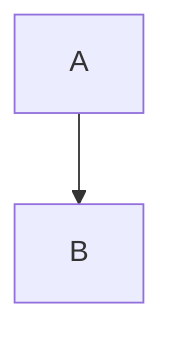

# Conformance corpus

A paragraph with *emphasis*, **strong**, ~~strike~~, `code`, a [link](other.md) and an image .
Its second line has entities &amp; &copy; &#123; and an escaped \* star.
A hard break ends this line  
and a backslash break ends this one\
before the last line.

Setext heading
--------------

> A quote with a softbreak
> on its second line.
>
> A second paragraph in the quote.

- tight item one
- tight item *two*
  - nested tight item
  - nested item with `code`
- tight item three

1. loose item one

2. loose item two

   with a second paragraph

- [ ] an open task
- [x] a *done* task

| Column | Other `code` |
| ------ | :----------: |
| one    | two          |
| **three** | [four](x.md) |

```ts
const greeting: string = "hello <world>";
function twice(value: number): number {
  return value * 2;
}
```

```
plain fence with <angle brackets> & ampersands
```



    indented code
    second line

<details>
<summary>An HTML block</summary>

</details>

Inline <span class="note">HTML</span> and an autolink <https://example.com>.

Wrap the form in a <div> element so it lays out.

***

Last paragraph.
